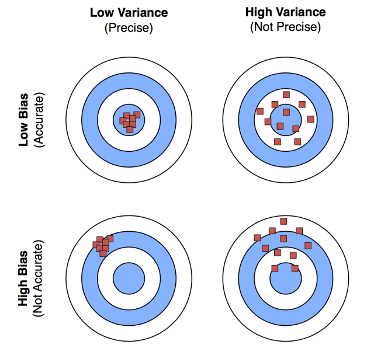

# Nature inspired computation

#### Evolutionary and natural computation
* evolution as an algorithm &rarr; progress, adaptation, learning, survival of the fittest

Template of evolutionary program:
```python
generate a population of agents (objects, data structures)
do {
    compute fitness (quality) of the agents
    select candidates for the reproduction using fitness
    create new agents by combining the candidates
    replace old agents with new ones
} while (not satisfied)
```

#### Genetic algorithms
* Holland, 1970's, based on Darwinian evolution
* genes represented as bit/numeric vectors/strings...
* applications: optimization, scheduling, bioinformatics, ML, planning...
* **crossover**: 
    + single point, multipoint
    + linear (linear combination of 2 individuals $\alpha x + (1-\alpha)y$)
    + permuation and ordered crossover (keep part of sequences to not get invalid solutions)
    + adaptive (different evolution phases and crossover templates)
* **mutation**:
    + sffing nre information
    + single point/multipoint
    + Lamarckianism (organism can pass on characteristics that it has acquired through use/disuse during its lifetime to its offsprint - giraffe)
    + Gaussian (selects a position in the vecot of floats and mutates ut by adding Gaussian error)

#### Selection - who will reproduce?
+ **proportional**
+ **rank proportional**
+ **tournament:** randomly sample $t$ sgents from population, select the best with probability $p$, second best with $p(1-p)$...
+ **single tournament:** randomnly split population into small groups, apply crossover to 2 best agents from each group, their offspring replace two worst agents from group
+ **stohastic universal sampling**

Replacement - all, according to fitness (roulette, tournament, random), elitism (portion of the best), local elitism (children replace parents if they are better)
Stopping criteria - number of generations, track progress, avaliability of computational resources...
Multiobjective optimization - fitness function with several objectives, $min F(x) = min (f_1(x),...,f_n(x))$

#### Strenghts and weaknesses
+ robust, adaptable, general, requires weak knowledge of the problem, several alternative solutions, parallelization, faster and less memory than search
+ suboptimal solutions, possibly many parameters, can be computationally expensive
+ **no-free-lunch theorem** (an algorithm that performs exceptionally well on one class of problems must compensate by performing worse on another class of problems)

#### Neuroevolution
+ evolving neuros/topologies
+ evolving weights instead of backpropagation/gradient descent


# Statistical Predictive Modeling

#### Learning
+ act of acquiring new or modifying and reinforcing existing knowledge, behaviours, skills, values, preferences
+ synthesizing different types of information
+ statistical learning &rarr; finding a predictive function based on data
+ basic task in ML &rarr; learning from past examples with known outcomes

#### Notation
+ the variable we wish to predict/target: $Y$
+ input variables/attributes, features: $X_i$
+ input vectors form a matrix: $X = \begin{pmatrix} x_{11} & x_{12} & \cdots & x_{1p} \\ x_{21} & x_{22} & \cdots & x_{2p} \\ \vdots & \vdots & \ddots & \vdots \\ x_{n1} & x_{n2} & \cdots & x_{np} \end{pmatrix} $
+ **model: $Y = f(X) + \epsilon$**
+ $Y_i = f(X_i)+\epsilon_i$

#### Goals of learning
+ **prediction:**
    + if we make a good estimate for $f$ and we have small variance of $\epsilon$, we can make accurate predictions for $Y_i$ based on new $x_i$
+ **inference:**
    + relationship between $Y$ and $X_i$

#### Statistical learning methods

**Parametric methods:**
+ reduce the problem of estimating $f$ to estimating a set of parameters in 2 steps
+ **step 1** &rarr; come up with a model of $f$ (usually linear): $f(X_i) = \beta_0 + \beta_1 X_{i1} + \beta_2 X_{i2} + \cdots + \beta_p X_{ip}$
+ **step 2** &rarr; use training data to fit the model and estimate unknown parameters $\beta_i$

**Non-parametric methods:**
+ no assumptions about $f$
+ advantage &rarr; accurately fit a wider range of possible shapes of $f$
+ disatvantage &rarr; need a large amount of observations

**Trade-off between prediction accuracy and model interpretability:**
+ simple methods produce models that are easier to interpret
+ it's possible to get more accurate predictions with simpler models (hard models are harder to git)

#### Dividing learning problems

+ **Supervised learning:**
    + both the predictions ($X_i$) and the response ($Y_i$) are observed
+ **Unsupervised learning:**
    + only observe the predictions ($X_i$) 
    + use the predictions to guess the response and then build a model *(clustering)*
+ **Semi-supervised learning:**
    + small sample of labelled instances are observed, a large sample of unlabeled instances
    + initial supervised model used to label unlabeled instances
    + add the ost reliable predictions to the training set for next iteration
+ **Self-supervised learning:**
    + learns from unlabeled data
    + labels obtained from related properties of the data
    + predicts unobserved/hidden property of the input
+ **Weakly-supervised data:**
    + noisy sources used to provide supervision signal for labeling large amounts of training data for supervised learning

#### Regression VS classification
We can split **supervised learning problems** into regression and categorical problems. In **regression** problems $Y$ is continuous and in **classification** problems, $Y$ is categorical. Some methods

#### Data mining
Association and correlation analysis:
+ frequent patterens
+ association, correlation VS causality

Outlier analysis:
+ **outlier** = data object that does not comply with the general behaviour of the data
+ noise or exception?

#### Criteria of success for ML
The goal of classification is minimizing the test error. Many algorithms solve optimization problems - minimizing the error.

Criteria of success for ML:
+ **regression:**
$$\text{MSE} = \frac{1}{n} \sum_{i=1}^n (y_i - f'(x_i))^2$$
+ **classification:**
$$\text{CA} = \frac{1}{n} \sum_{i=1}^n I(y_i = y'_i)$$

#### No-Free-Lunch theorem
If no information about the target function $f$ is provided:
+ generally no classifier is better than some other
+ generally no classifier is better than random


# Bias, variance and predictive models

#### Bias and variance of prediction models
Our method designed to minimize the error on the training data. We care about how well the method **generalizes** - how it works on new data (test data). In general, the more flexible a method is, the better it will fit the training data. The less flexible the method, the easier it is to interpret the data.

**Bias-variance trade-off:**
+ **bias:**
    + error we get by modeling a complicated real life problem by a much simpler problem
    + $\text{bias}=E[Y]-f(x)$
    + the more flexible a method is, the less bias it will have
+ **variance:**
    + how much the estimate for $f$ would change if it had a different training data set
    + $\text{Var} = E[(Y-E[Y])^2]$
    + the more flexible a method is, the more variance it has

<table style="border-collapse: collapse; border: none;">
<tr>
<td valign="top" width="50%" style="border: none;">

**Bias-variance trade-off:**
+ **bias:**
    + Error we get by modeling a complicated real-life problem by a much simpler problem.
    + $\text{bias} = E[Y] - f(x)$
    + The more flexible a method is, the less bias it will have.
+ **variance:**
    + How much the estimate for $f$ would change if it had a different training data set.
    + $\text{Var} = E[(Y-E[Y])^2]$
    + The more flexible a method is, the more variance it has.
+ **trade-off:**
    + for any given $X=x_0$, the expected test MSE for new $Y$ at $x_0$ will be:
    $$\text{ExpectedTest MSE} = \text{bias}^2 + Var + \sigma^2$$
    where $\sigma$ is an irreducible error
    + as the method gets more complex, the bias will decrease and the variance will likely increase

</td>
<td valign="top" width="50%" style="border: none;">


<!-- Replace `URL_to_Image` with the actual URL of your image -->

</td>
</tr>
</table>

#### Bayes optimal classifier

**Bayes optimal classifier** is obtained by selecting the class $j$, which mazimizes the probability $P(Y=j|X=x_0)$. It implies that learning is an estimation of conditional data distribution.

**Bayes error rate** is the lowest possible error rate that could be achieved, if we knew the true probability distribution. No classifier than Bayes error rate can get lower error rates on test data.

**Naive Bayesian classifier:**
$$P(C \mid X_1, X_2, \ldots, X_n) \approx \frac{P(C) \cdot \prod_{i} P(X_i \mid C)}{\prod_{i} P(X_i)}$$

#### Simple regression models:
+ Linear models
+ Nearest neighbor
+ Regression trees, regression rules

#### K-Nearest Neighhbors
+ flexible approach to estimate Bayes classifier
+ for given $x$ we find $k$ closest neighbors to $x$ in the training data and examine their $y$'s 
+ predict based on majority class of $y$

**KNN classifier:**
$$\Pr(Y = j \mid X = x_0) = \frac{1}{K} \sum_{i \in N_0} I(y_i = j)$$

**Training VS test errors:**
* training error decreases with $k$
* test error rate decreases at first (reduction in bias dominates), but then starts to increase (increase in variance dominates)
* double descent curve (overparametrization at interpolation threshold)

**KNN for regression:**
$$f(x) = \frac{1}{k} \sum_{x_i \in N_i} y_i$$

#### Decision trees and rules

**Using IF-THEN rules for classification:**
+ **assesment** of rules &rarr; measuring the coverage and accuracy of rules:
    + coverage = the proportion of dataset instances that a rule applies to
    + ccuracy =  how many of these instances are correctly predicted
+ **conflict resolution** &rarr; when multiple rules are applicable we use different methods to prioritize them:
    + size ordering: highest priority goes to toughest requirements
    + clas-based ordering: misclassification cost per class
    + **decision list** (rule-based ordering): rules organized into priority list according to some measure 

**Rule extraction from a decision tree:**
+ one rule created for each path from root to leaf
+ mutually exclusive and exhaustive rules (conjunctions)

**Rule induction, sequential covering method:**
+ xtracts rules directly from training data
+ rules learned sequentially &rarr; rule for a class $C_i$ will cover many instances of $C_i$ but none/few instances of other classes
+ rules learned one by one, each time a rule is learned the instances that this rule covers, are removed

```python
while (enough target instances left)
    generate a rule
    remove positive target instances satisfying this rule

def generate a rule:
    while(true)
        find the best predicate p
        if ruleQuality(p) > threshold then add p to current rule
        else break
```
**How to learn a rule:**
+ start with a general rule &rarr; empty condition, applies to all instances
+ attribute addition using a greedy strategy
+ measure rule quality &rarr; coverage, accuracy
$$\text{Gain}(R_0, R_1) := t \cdot \left( \log_2 \left( \frac{p_1}{p_1 + n_1} \right) - \log_2 \left( \frac{p_0}{p_0 + n_0} \right) \right) $$
+ rule pruning &rarr; use the created rules to prune them using an independent set of validation instances (favors rules that maintain high accuracy), decision on pruning:
$$\text{FOIL\_Prune}(\text{Rule}) = \frac{\text{pos} - \text{neg}}{\text{pos} + \text{neg}}$$

#### Biases in data
+ ML models aren't inherently objective
+ models trained by data sets which can be susceptible to bias
+ when building models we must be aware of common human biases than can manifest in data

**Reporting bias:**
+ frequency of outcomes captured in the data set does not accurately reflect their real-world frequency
+ because people document unusual circumstances, assuming the ordinary can go without saying
+ *very positive/negative comments but not mid ones*

**Automation bias:**
+ tendency to favor results generated by automated systems or opposite
+ *model to identify tooth decay, but is worse than human inspections*

**Selection bias:**
+ if data set's examples are chosen in a way that is not reflective of their real-world distribution
+ **coverage bias:**
    + data not selected in a representative way
    + *predicting future sales but not interviewing people who didn't buy the product*
+ **non-response bias:**
    + oarticipation gaps in the data-collection process
    + *predicting future sales and the customers who bought competing poducts refuse to complete the survey*
+ **sampling bias:**
    + not using proper randomization during data collection

**Group attribution bias:**
+ tendency to generalize what is true of individuals to an entire group
+ **in-group bias:**
    + preference for members of a group to which you belong
+ **out-group bias:**
    + tendency to stereotype individual members of the group to which you don't belong

**Implicit bias:**
+ assumptions are made based on one's personal experiences that don't necessarily apply generally
+ **confrirmation bias:**
    + model builders unconsciously process data in ways that affirm preexisting beliefs and hypotheses
+ **experimenter's bias:**
    + model builder keeps training the model until it produces a result that aligns with their original hypothesis

#  Feature engineering

#### Data preprocessing

+ **Data cleansing** &rarr; removing/correcting corrupted/invalid values
+ **Instances selection and partitionin**g &rarr; training, evaluation, testing sets
+ **Feature tuning** &rarr; scaling/normalizing/clipping, outliers...
+ **Feature transformation** &rarr; discretization/numerization (converting - depends on what we need)
+ **Feature extraction** &rarr; lower the dimensionality (PCA)
    + reduces time and spac complexity, more robust on small datasets, more interpretable
+ **Feature selection** &rarr; discard irrelevant/redundant features
    + better learning performance (accuracy, computational cost, interpretablity)
+ **Feature construction** &rarr; creating new features using different operators
+ For unstructured data: often only modest preprocessing is needed for neural networks

#### Feature subset selection: filter, wrapper and embedded methods

In order to select attributes, we have to rank them. The success of feature evaluation is measured through the success of learning. We have 3 types of feature selection methods.

**Filter methods:**
+ independent on learning algorithm, select the most discriminative feautres based on criteria (IG)
+ different heuristic measures of attribute evaluation
    + impurity based: IG (purity of labels before and after the split), IGR, Gini, MSE...
    + context sernsitive measures: Relief
        + evaluate attribute according to its power of seperation between near instances
        + no assumption of conditional independence, context sensitive
        ```matlab
        %Input: set of instances <x_i,tau_i>
        %Output: the vector W of attributes’ evaluations

        set all weights W[A] := 0.0;
        for i := 1 to m do begin
            randomly select an instance R;
            find nearest hit H and nearest miss M;
            for A := 1 to #all_attributes do
                W[A] := W[A] - diff(A,R,H)/m + diff(A,R,M)/m;
        end;
        ```
        + function $\text{diff}$:
            + nominal: $\text{diff}(A, I_1, I_2) = \begin{cases} 0, & \text{if } value(A, I_1) = value(A, I_2) \\ 1, & \text{otherwise} \end{cases}$
            + numerical: $\text{diff}(A, I_1, I_2) = \frac{|value(A, I_1) - value(A, I_2)|}{max(A) - min(A)}$
            + distance between 2 instances: $\delta(I_1, I_2) = \sum_{i=1}^a \text{diff}(A, I_1, I_2)$
+ multivalued attributes (insuficient statistical support in some splits), numeric attributes (can require prior discretization)

**Embedded methods:**
+ select features in the process of learning
+ loss function composed of prediction error and weight of included features: $L(X, Y, f) = \sum_{i=1}^n I(Y_i \neq f(x_i)) + \lambda \sum_{j=1}^a I(A_j \in X)$
+ ridge regression:
    $$\sum_{i=1}^n \left( y_i - \beta_0 - \sum_{j=1}^p \beta_j x_{ij} \right)^2 + \lambda \sum_{j=1}^p \beta_j^2 = \text{RSS} + \lambda \sum_{j=1}^p \beta_j^2$$
    + minimizes $\sum_{j=1}^p \beta_j^2$, adds a penalty term &rarr; improves the fit, bias-variance trade-off
    + estimates more biased than $\text{OLS}$, but have lower variance
    + for any given $\lambda$, we only need to fit 1 model with simple computations, we can use ridge regression where $\text{OLS}$ fails ($p>n$)
+ LASSO method:
    + ridge regression imperfect: the final model includes all variables and is hard to interpret
    $$\text{RSS} + \lambda \sum_{j=1}^p |\beta_j|$$
    + minimizes $\sum_{j=1}^p |\beta_j|$
    + using this method, the coefficients can be set to 0, which means it's easier to interpret

**Wrapper methods:**
+ intended learning algorithm to evaluate the features (SVM)
    ```matlab
    start with an empty set of features S={} % forward selection
    repeat:
        add all unused features one by one to S
        train a prediction model with each set S
        evaluate each prediction model
        keep the best added feature in S
    until all features are added to S
    return the best set of features encountered
    ```
+ high computational load, very effective

#### Model evaluation

+ Regression: MSE, MAE
+ Classification: accuracy, sensitivity, specificity, AUC, precision, recall
+ Comparing classifiers:
    + Mean and confidence intervals
    + Cost-benefit analysis and ROC Curves
    + Rank-based tests (Friedman/Nemenyi)
    + Bayesian (hierarchical) tests

$$\text{Accuracy} = \frac{TP + TN}{\text{All}}$$

$$\text{Error Rate} = 1 - \text{Accuracy} = \frac{FP + FN}{\text{All}}$$

$$\text{Sensitivity} = \frac{TP}{P}$$

$$\text{Specificity} = \frac{TN}{N}$$

$$\text{Precision} = \frac{TP}{TP + FP}$$

$$\text{Recall} = \frac{TP}{TP + FN}$$

$$F = \frac{2 \times \text{Precision} \times \text{Recall}}{\text{Precision} + \text{Recall}}$$

$$F_\beta = \frac{(1 + \beta^2) \times \text{Precision} \times \text{Recall}}{\beta^2 \times \text{Precision} + \text{Recall}}$$

+ Multiclass evaluation: macro average (several one-versus-all), micro average (for each class seperately)
+ ROC curve: shows TP and FP rate, area under ROC curve is used to summarize overall performance &rarr; the larger AUC the better

**Issues affecting model selection:**
+ accuracy
+ speed (training time, prediction time)
+ robustness (handling noise, missing values)
+ scalability
+ interpretability

**Unsupervised feature selction:**
+ preserve similarity between instances

**Semi-supervised feature selction:**
+ small sample of labelled and large sample of unlabelled data
+ use label information of labeled data, data distribution/structure of both

**Stability of feature seleciton:**
+ issue for high dimensional small sample data
+ solution = **ensemble approach**:
    + produce diverse feaure sets
    + aggregate them

#### Dimensionality reduction
#### Feature selection extensions: unsupervised and semi-supervised learning, multitask, multi-view, multi-label learning