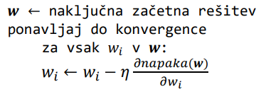
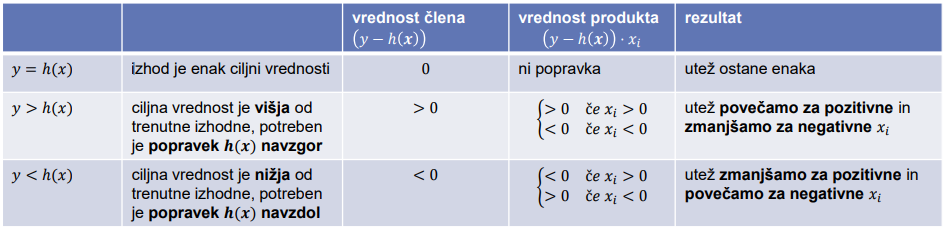
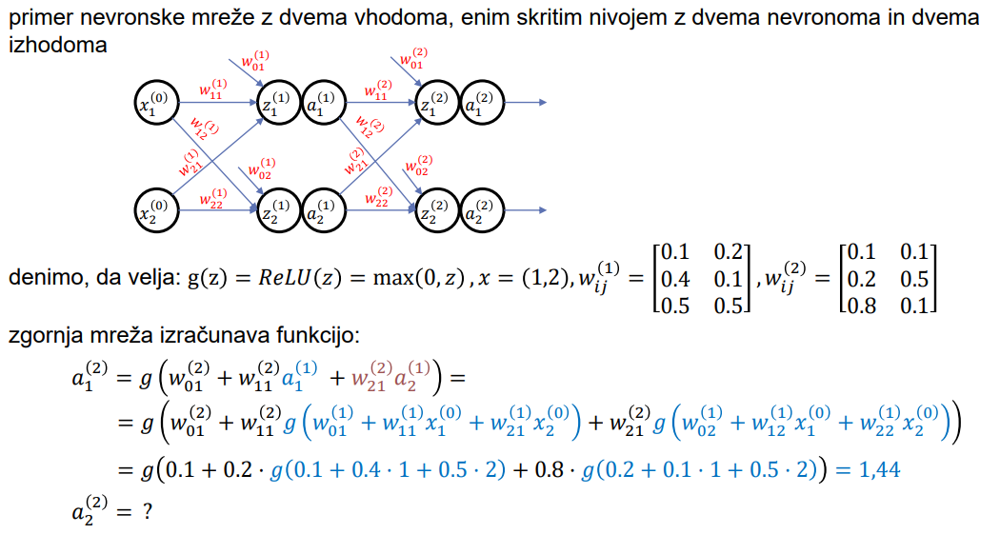
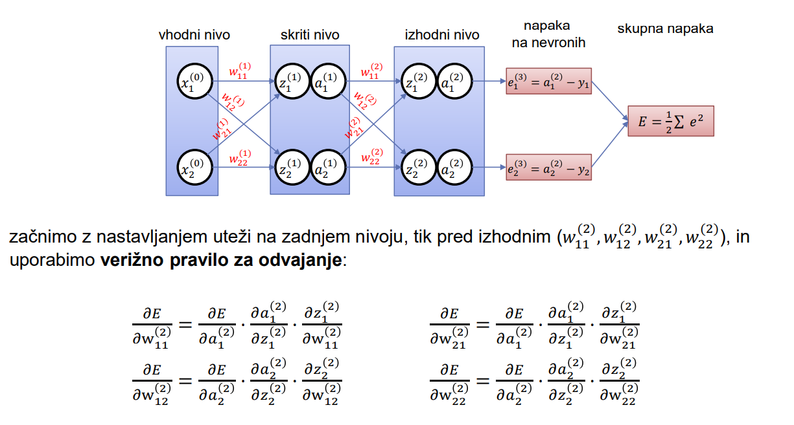
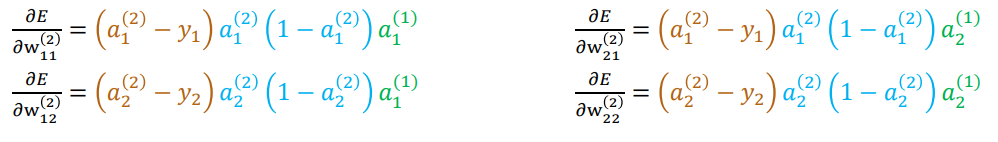
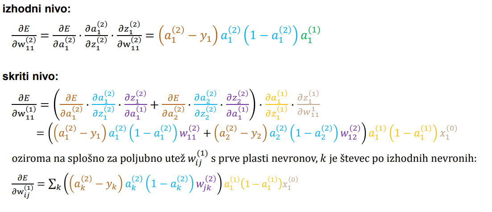

# Umetna inteligenca, uvod v strojno učenje

#### Kaj je umetna inteligenca?
+ **Cilj:** razumeti in zgraditi inteligentne sisteme na osnovi človeškega razmišljanja, sklepanja, učenja, komuniciranja
+ vse kar dela človek ni nujno inteligentno - ali modelirati človeka ali ideal? (princip racionalnosti/optimalnosti)

#### Turingov test
Je **praktični preizkus**, ki ga je predlagal Turing, za testiranje, ali je sistem dosegel stopnjo inteligence, primerljivo s človekom. Računalnik preizkus opravi, če človeški izpraševalec po računalnikovih odgovorih ne more določiti, ali je odgovarjal človek, ali računalnik. Problem testa je v tem, da ga ni možno reproducirati ali podvreči matematični analizi.

#### Osnove umetne inteligence
+ strojno učenje
+ reševanje problemov
+ planiranje, razporejanje opravil
+ sklepanje

# Strojno učenje

#### Kaj je?
Področje umetne inteligence, ki raziskuje, kako se lahko **algoritmi samodejno izboljšujejo ob pridobivanju izkušenj**. To je potrebno, ker ni vedno možno predvideti vseh problemskih situacij ali sprememb, ali pa preprosto ni mogoče sprogramirati vsega znanja.

#### Vrste učenja
* **Nadzorovano učenje:** učni primeri podani kot vrednosti vhodov in izhodov &rarr; funkcija, ki preslika vhode v izhode (odločitveno drevo)
* **Nenadzorovano učenje:** učni primeri niso označeni - ni ciljne spremenljivke &rarr; vzorci v podatkih (gručenje)
* **Spodbujevano učenje:** inteligentni agent se uči iz zaporedja nagrad in kazni

#### Nadzorovano učenje
+ **Podana**: množica učnih primerov $(x_1,y_1), ..., (x_N,y_N)$, kjer je vsak $y_i$ vrednosti neznane funkcije $y=f(x)$
+ **Naloga**: iščemo funkcijo $h$, ki je najboljši približek $f$
+ poimenovanje: $x_i$ so atributi, $h$ je hipoteza

* imamo 2 vrsti problemov:
    + **Klasifikacijski problem:** $y_i$ diskretna spremenljivka
    + **Regresijski problem:** $y_i$ zvezna spremenljivka

>**Klasifikacija:**
>+ $y$ je diskreten (končen nabor vrednosti)
>+ $y$ se imenuje razred

>**Regresija:**
>+ $y$ je zvezen (neko število)
>+ $y$ se imenuje označba

* **Hipoteze:**
    + dobra hipoteza je dovolj **splošna** &rarr; pravilno napoveduje vrednost $y$ za nove primere
    + princip **Ockhamove britve** za izbor primerne hipoteze &rarr; najbolj preprosta
* **Prostor hipotez:**
    + binarna klasifikacija z $n$ atributi &rarr; $2^n$ različnih učnih primerov in $2^{2^n}$ hipotez
    + potrebni algoritmi za gradnjo dobrih hipotez in metode za ocenjevanje hipotez/učenja
* **Evalviranje hipotez:**
    + konsistentnost hipotez z učnimi primeri
    + splošnost (točnost za nevidene primere)
    + razumljivost

>Klasifikacijska točnost:
>$$ CA = \frac{TP + TN}{TP + TN + FP + FN} = \frac{TP + TN}{N} $$
>&nbsp;

#### Učenje odločitvenih dreves

+ **Odločitveno drevo:**
    + ponazarja relacijo med atributi (vhodne vrednosti) in ciljno spremenljivko (odločitev)
    + cilj zgraditi čim **manjše** drevo, **konsistentno** z učnimi podatki
    + **TDIDT:** hevristični požrešni algoritem, razveji in omeji &rarr; izbere najbolj pomemben atribut, rekurzivno ponavlja za poddrevesa
+ Izbor najbolj pomembnega atributa:
>    + **entropija:** $$H = -\sum_k p_k \log_2 p_k$$
>    + **informacijski prispevek:** $$IG(A) = I - I_{res}(A)$$
>$$ I_{\text{res}} = -\sum_{v_i \in A} p_{v_i} \sum_c p(c \mid v_i) \log_2 p(c \mid v_i)$$
>    + **information gain ratio:** $$GR(A) = \frac{IG(A)}{I(A)}$$
>    + **gini index:** $$\text{Gini}(A) = \sum_v p(v) \sum_{c_1 \neq c_2} p(c_1 \mid v) p(c_2 \mid v)$$
+ Težava z večvrednostmi atributi &rarr; relativni informacijski prispevek ($GR$), alternativne mere ($Gini$), binarizacija atributov (višja $CA$)
+ Kratkovidnost TDIDT: najboljši atribut izbira lokalno
+ Privzeta točnost: uporabljamo verjetnost večinskega razreda &rarr; drevo je uporabno, če je njegova točnost višja od privzete
+ Pristranost na učni množici: lahko pride do pretiranega prilagajanja na učni množici &rarr; podatke zato delimo na učno in testno množico ($70-30$)

#### Učenje dreves iz šumnih podatkov

Možne težave zaradi nepopolnih podatkov:
+ učenje šuma in ne dejanske funkcije, ki generira podatke
+ pretirano prilagajanje vodi v prevelika drevesa
+ slaba razumljivost dreves
+ nižja $CA$ na novih podatkih

Rešitev za nastale težave je **rezanje dreves**. Ideja za rešitev je, da nižji deli drevesa predstavljajo večje lokalno prilagajanje učnim podatkom. Zato drevo režemo, da dosežemo večjo posplošitev.

Rezanje dreves:
+ **Rezanje vnaprej**:
    + dodatni kriterij za zaustavitev gradnje drevesa, hitro, kratkovidno
+ **Rezanje nazaj**:
    + po gradnji celotnega drevesa odstranimo manj zanseljive dele, počasno, upošteva informacijo celega drevesa
>    + **REP - rezanje z zmanjševanjem napake:**
>        + uporaba rezalne možice
>        + delitev podatkov: učna množica (70%, od tega 70% za gradnjo, 30% rezalna), testna množica (30%)
>    + **MEP - rezanje z minimizacijo napake:**
>        + za vsako vozlišče izračunamo statično napako ($e$), in vzvratno napako ($E$)
>        + režemo, če je statična napaka manjša od vzvratne ($E \geq e$)

Ocenjevanje verjetnosti (ocena napake v vozlišču):
>* **Laplaceova ocena:**
>    + ne upošteva apriorne verjetnosti
>    $$p = \frac{n + 1}{N + k}$$
>* **m-ocena:** 
>    + manj kot je šuma, manjši je $m$
>    + posplošitev Laplaceove za $m=k$, $p_a = \frac{1}{k}$
>    $$p = \frac{n + p_am}{N + m}$$

#### Ocenjevanje učenja

Hipoteze ocenjujemo glede na njihovo točnost, razumljivost in/ali kompleksnost. Točnost lahko ocenjujemo na učnih, testnih (intervali zaupanja) ali novih podatkih. Za uspešno učenje in za zanesljivo ocenjevanje rabimo čim več podatkov, kar si nasprotuje. Možni rešitvi sta izločevanje testne množice kadar je učnih podatkov dovolj, ali večkratne delitve na učno in testno množico.

**k-kratno prečno preverjanje:**
+ celo učno množico razdelimo na $k$ disjunktnih množic
+ za vsako disjunktno množico, to množico uporabimo kot **testno**, preostalih $k-1$ množic pa kot **učno**
+ vplive izbranega razbitja na podmnožice zmanjšamo z večkratnim ponavljanjem preverjanja
+ metoda **izloći enega:** $k$ je enak številu primerov, najbolj stabilno, časovno zelo zamudno

#### Vrste atributov, diskretizacija, obravnava manjkajočih vrednosti

Zvezne ali numerične atribute načeloma diskretiziramo z intervali, ki **maksimizirajo informacijski prispevek**.

Obravnava **manjkajočih vrednosti atributov** vključuje različne pristope, kot so učenje z manjkajočimi vrednostmi, ignoriranje primerov z neznanimi vrednostmi, uporaba posebne oznake (NA/UNKNOWN), nadomeščanje manjkajočih vrednosti (npr. z povprečno, najbolj pogosto ali napovedano vrednostjo)...

#### Naivni Bayesov klasifikator

>**Bayesovo pravilo:**
>$$P(B|A) = \frac{P(A|B) \cdot P(B)}{P(A)}$$
>
>**Naivni Bayes:**
>$$P(C \mid X_1, X_2, \dots, X_n) = \frac{P(C) \cdot P(X_1, X_2, \dots, X_n \mid C)}{P(X_1, X_2, \dots, X_n)} $$
>$$P(C \mid X_1, X_2, \ldots, X_n) \approx \frac{P(C) \cdot \prod_{i} P(X_i \mid C)}{\prod_{i} P(X_i)}$$
>(približki veljajo le, le so atributi med sabo dovolj neodvisni)
>&nbsp;
>**Bayesov klasifikator:** primer klasificiramo v razred, ki je najbolj verjeten
>$$h(C_k \mid X_1, X_2, \ldots, X_n) = \arg \max_{C_k} \left( P(C_k) \prod_{i=1}^n P(X_i \mid C_k) \right)$$
>&nbsp;

#### Nomogrami

Nomogram je pristop za vizualizacijo naivnega Bayesovega modela. Prikazuje pomembnost posameznih vrednosti vsakega atributa na ciljni razred. Vsaka vrednost atributa doprinaša določeno število točk k ciljnemu razredu. 

>**Skupno število točk:**
>$$\text{tocke}(C \mid X_1, X_2, \ldots, X_n) = \sum_i \log \frac{P(X_i \mid C)}{P(X_i \mid \overline{C})}$$
>$$\frac{P(C \mid X_i)}{P(\overline{C} \mid X_i)} = \frac{\frac{P(C \mid X_i)}{P(C)}}{\frac{P(\overline{C} \mid X_i)}{P(\overline{C})}}$$
>(izračun)

#### Metoda $k$ najbližjih sosedov
+ neparametrična metoda
+ učenje na podalgi posameznih primerov
+ leno učenje (odlaša z učenjem do povpraševanja o novem primeru)
+ ideja: ob vprašanju po vrednosti odvisne spremenljivke za novi primer poiščemo $k$ najbližjih primerov glede na neko mero razdalje

**Razdalja Minkowskega:**
$$L^p(x_i, x_j) = \left(\sum_k |x_{i,k} - x_{j,k}|^p\right)^{\frac{1}{p}}$$

>**Evklidska razdalja:**
>$$L^2(x_i, x_j) = \sqrt{\sum_k (x_{i,k} - x_{j,k})^2}$$
>
>**Manhattenska razdalja:**
>$$L^1(x_i, x_j) = \sum_k |x_{i,k} - x_{j,k}|$$

Za diskretne atribute uporabljamo **Hammingovo razdaljo** (đtevilo neujemajočih atributov pri primerih).

Lahko pride do vpliva intervala vrednosti na razdaljo, zato je potrebna **normalizacija**. Prav tako lahko primeri pri velikem številu dimenzij postanejo zelo oddaljeni - **prekletstvo dimenzionalnosti**.

#### Lokalno utežena regresija - $k$NN za regresijo

Uteževanje z razdaljo:
$$ h(x) = \frac{\sum_{i=1}^k w_i f(x_i)}{\sum_{i=1}^k w_i} $$
$$ w_i = \frac{1}{(d(x,x_i))^2} $$

Pri uteževanju lahko uporabljamo tudi poljubno jedrno funkcijo - Gaussovo jedro. Če je jedro preširoko, lahko pride do underfittinga, če pa je jedro preozko, pa lahko pride do overfittinga.

#### Regresijska drevesa

Regresijski problem je, ko imamo **zvezno ciljno spremenljivko**. So odločilna drevesa za regresijske probleme. Njihovi listi predstavljajo povprečno vrednost označb primerov v listih, ali preprost napovedni model za nove primere.

>Za merjenje nedoločenosti uporabljamo **srednjo kvadratno napako** v vozlišču $v$:
>$$\text{MSE}(v) = \frac{1}{n} \sum_{i=1}^n (y_i - \bar{y})^2$$
>
>Cilj je **minimizirati rezidualno nedoločenost**:
>$$I_{\text{res}}(A) = p_{\text{left}} \cdot I_{\text{left}} + p_{\text{right}} \cdot I_{\text{right}}$$
>&nbsp;

#### Linearna regresija

**Linearni modeli:**
+ uporabimo pri klasifikaciji in regresiji
+ linearni model z 1 odvisno spremenljivko: $h(x) = w_1x+w_0$
+ linearna regresija je postopek iskanja funkcije $h(x)$, ki se najbolje prilega učnim podatkom

Optimizacijo izvcajamo z minimiziranjem $\text{MSE}$:
$$
\text{napaka}(h) = \sum_{j=1}^N (y_j - (w_1 x_j + w_0))^2
$$

Ker lokalnih minimumov ni in obstajajo samo globalni, obstaja analitična rešitev:
$$
w_0 = \frac{\sum y_j - w_1 \sum x_j}{N}
$$
$$
w_1 = \frac{N \left(\sum x_j y_j\right) - \left(\sum x_j\right)\left(\sum y_j\right)}{N \left(\sum x_j^2\right) - \left(\sum x_j\right)^2}
$$

**Posplošitev v več dimenzij:**
+ imamo več neodvisnih spremenljivk
+ $h(x) = w_0 + \sum_i w_i x_{j,i}$
+ analitična določitev uteži: $\mathbf{w} = (\mathbf{X}^T \mathbf{X})^{-1} \mathbf{X}^T \mathbf{y}$

V praksi uporabimo **gradientni spust**:

  

**Linearni modeli pri klasifikaciji:**
+ $h_w(x) = w_0 + w_1 x_1 + ... + w_n x_n$
+ preprosto iskanje rešitve &rarr; **stohastični gradientni spust**: $w_i \leftarrow w_i + \eta (y - h(x)) x_i$

  

#### Nevronske mreže

**Umetni nevron izračuna uteženo linearno kombinacijo vhodov in jo z aktivacijsko funkcijo preslika v izhodno vrednost.**

**Aktivacijska funkcija:**
+ cilj: zagotoviti da cela nevronska mreža zagotavlja nelienarno funkcijo
+ **nevron** &rarr; implementira linearno funkcijo v problemskem prostoru
+ **nevronska mreža** &rarr;  množica nevronov, ki so medsebojno povezani v topologijo
    + izračunavanje kombinacij funkcij različnih nevronov

**Implementacije mrež:**
+ **feed-forward network** &rarr; aciklične povezave samo v smeri od vhoda proti izhodom (*ni hranjenja notranjega stanja*)
    + nevroni v plasteh
    + en ali več izhodov
+ **rekurenčna mreža** &rarr; uporablja izhode kot ponovne vhode v mrežo
    + kratkoročni spomin (*hrani notranje stanje*)
+ **konvolucijske mreže**

  

**Vzvratno razširjanje napake:**
1. inicializiraj uteži
2. izraćunaj napovedi
3. izračunaj izgubo
4. vzvratno razširi napako iz izhoda proti vhodu:
    + gradient napake za vse nivoje
5. za vsak $w$ uporabi obliko gradientnega spusta, da popraviš vrednost uteži s hitrostjo učenja
    + $w \leftarrow w - \eta \frac{\partial E}{\partial w}$
6. ponavljaj 2-5 do ustavitvenega kriterija

**Učenje nevronske mreže:**
+ za dani učni primer izračunami aktivacije nevronov in jih primerjamo s ciljnimi vrednostmi: $E = \frac{1}{2} \sum_k \left( a_i^{(L)} - y_i \right)^2$
+ cilj: nastaviti **vse uteži** v nevronski mreži, da se napaka minimizira (zanima nas $\frac{\delta E}{\delta w}$)

  

  

  

#### Nenadzorovano učenje

Pri nenadzorovanem učenju **nimamo cilnje spremenljivke**, zato nas napoved primera ne zanima. Naš cilj je odkiravnje zakonitosti glede porazdelitve učnih primerov - ali jih lahko razdelimo v skupine/priročno vizualiziramo... Je bolj **subjektivno** kot nadzorovano, in velikokrat lažje pridobimo neoznačene podatke.

**Gručenje:**
+ iskanje homogenih podskupin v učnih podatkih
+ **hierarhično gručenje** &rarr; iščemo vnaprej neznano število gruč, rezultat je dendrogram
    + **združevalni pristop:** gradnja dendrograma se začne od listov proti korenu s postopkom združevanja glede na razdaljo
        >+ *single linkage*: razdalja med najbližjima primeroma
        >+ *complete linkage*: razdalja med najbolj oddaljenema primeroma
        >+ *average linkage*: povprečno razdaljo med vsemi primeri
    + **delilni pristop:** od korena proti listom, deljenje gruč na podgruče
    + *opombe: normalizacija atibutov, časovna zahtevnost $O(n^2\log n)$*
+ **k-means/metoda voditeljev** &rarr; iterativno gručenje primerov v vnaprej podano število $k$ gruč
    + sprva naključno priredimo vsak učni primer eni od gruč
    + za vsako gručo izračunamo centroid in spremenimo pripadnosti učnih primerov ter ponavljamo do konvergence
    + v vsakem koraku se zmanjšuje varianca znotraj gruč, ne najdemo globalnega optimuma, rešitev odvisna od začetne inicializacije, občutljiv na šum

# Preiskovanje

#### Definicija in cilji področja

Za **formalni opis problema** potrebujemo:
+ začetno stanje
+ opis vseh možnih akcij na razpolago v posameznih stanjih
+ prehodno funkcijo (definira naslednika stanja)
+ ciljni predikat
+ cenilno funkcijo, ki vsaki poti določi ceno

Problem rešujemo z iskanjem poti v grafu s preiskovanjem. Rešitev problema je zaporedje akcij, ki vodi od začetnega do ciljnega vozlišča.

Preiskovalne algoritme delimo na:
+ **neinformirani:**
    + razpolagajo samo z definicijo problema
    + BFS, DFS, iterativno poglabljanje, cenovno-optimalno iskanje
+ **informirani:**
    + razpolagajo z dodatno informacijo (domensko znanje, hevristične ocene) za boljšo učinkovitost
    + A*, IDA*, hill climbing, simulirano ohlajanje

Učinkovitost:
+ drevo ima višino $d$ in stopnjo vejanje $b$ &rarr; $b^d$ vozlišč, $max$ največja globina drevesa, C* cena optimalne rešitve, $\epsilon$ najmanjša cena povezave
+ **popolnost** &rarr; algoritem zagotovo najde rešitev, če ta obstaja
+ **optimalnost** &rarr; algoritem najde optimalno rešitev
+ **prostorska in časovna zahtevnost**

#### Neinformirani preiskovalni algoritmi

**BFS:**
+ hranimo kopije že obiskanih vozlišč
+ vozlišča, ki sklenejo cikel, takoj zavržemo
+ fronta = listi drevesa, ki so kandidati za razvijanje
+ zagotavlja najkrajšo rešitev
+ učinkovitost: popolnost, optimalnost (ni nujno), časovna in prostorska zahtevnost $O(b^d)$

**DFS:**
+ ne zagotavlja najkrajše rešitve
+ nujno moramo preprečiti cikel
+ lahko implementiramo rekurzivno
+ učinkovitost: nepopolnost, neoptimalnost, časovna zahtevnost $O(b^{max})$, prostorska zahtevnost $O(bm)$

**Iterativno poglabljanje:**
+ izboljšan DFS
+ učinkovitost: popolnost, optimalnost, časovna zahtevnost $O(b^d)$, prostorska zahtevnost $O(bd)$

**Dvosmerno iskanje:**
+ 2 iskanji - 1 iz začetka, 2 iz cilja, nekje se srečata &rarr; nižja časovna zahtevnost
+ vozlišča morajo imeti kazalce na predhodnika
+ učinkovitost: popolnost, optimalnost, časovna zahtevnost $O(b^{d/2})$, prostorska zahtevnost $O(b^{d/2})$

**Cenovno-optimalno iskanje:**
+ posploštev DFS
+ če cene vseh povezav niso enake, je optimalno razviti vozlišče z najmanjšo skupno ceno dosedanje poti $g(n)$
+ učinkovitost: popolnost, optimalnost, časovna in prostorska zahtevnost $O\left(b^{1 + \lceil c^* / \epsilon \rceil}\right),$

#### Informirani preiskovalni algoritmi

**Hevristično preiskovanje** je nastalo zaradi potrebe po usmerjanju iskanja z motivacijo, da algoritem hitreje najde optimalno rešitev. **Hevristika** je ocenitvena funkcija za obetavnost vozlišča. Izberemo in razvijemo vozlišče glede na najboljšo vrednost hhevristike. 

**Požrešno iskanje:**
+ vedno razvijemo najbolj obetavno vozlišče glede na hevristično oceno
+ učinkovitost: nepopolnost (ciklanje), neoptimalnost, časovna in prostorska zahtevnost $O(b^m)$

**A$^*$:**
+ $f(n) = g(n) + h(n)$ &rarr; $g(n)$ cena poti do $n$ (znano), $f(n)$ cena od $n$ do najbližjega soseda (ocena)
+ vozlišča v prioritetni vrsti glede na $f(n)$
+ je popoln in optimalen, če ustreza pogoju **dopustnosti**:
    + hevristika $h(n)$ je dopustna, če nikoli ne precenjuje cene do cilja: $\forall n: h(n) \leq h^*(n) $, kjer je $h^*(n)$ dejanska cena optimalne poti do cilja za vozlišče $n$
    + dokaz s protislovjem
+ učinkovitost: popolnost in optimalnost za dopustno hevristiko, časovna zahtevnost $O(b^{f(\epsilon)d})$, velika prostorska zahtevnost

**IDA$^*$:**
+ kot iterativno poglavljanje, le da za A*
+ redundanca - ponovno generiranje veliko vozlišč
+ neučinkovit z vozlišča z raznolikimi vrednostmi $f(n)$
+ razvija vozlišča v prioritetnem vrsnem redu, če je hevristična ocena $h(n)$ **monotona/konsistentna**: $\forall n,n' : h(n) \leq c(n,n') + h(n') $ &rarr; če je monotona/konsistentna je tudi **dopustna**

**Kakovost** hevrističnih funkcij lahko ocenimo s številom generiranih vozlišč, faktorjem vejanja...

#### Lokalni preiskovalni algoritmi in optimizacijski problemi

**Lokalni preiskovalni algoritmi:**
+ izvajajo iterativno ocenjevanje in spreminjanje podanih stanj (*namesto preiskovanja vseh možnih poti*)
+ koristni ko nas zanima zgolj rešitev ali pri optimizacijskih problemih s podano **kriterijsko funkcijo**
+ majhna poraba prostora, dobri približki rešitev

**Plezanje na hrib:**
+ premikanje po prostoru stanj v smeri najboljše izboljšave kriterijske funkcije
+ namen je najti globalni maksimum glede na kriterijsko funkcijo
+ težave: lokalni maksimumi, planote/rame, grebeni (za plezanje navzgor potreben sestop)
+ reševanje iz lokalnih maksimumov:
    + **koraki vstran** (premik v stran z isto vrednostjo kriterijske funckije)
    + **stohastično plezanje na hrib** (verjetnostno zbiramo naslednje stanje)
    + **naključni ponovni zagon**

**Simulirano ohlajanje:**
+ generiramo naključne sosede trenutnega stanja
+ boljše stanje izberemo vedno, slabše pa z določeno verjetnostjo
+ verjetnost izbire neoptimalnega stanja s časom pada

**Lokalno iskanje v snopu:**
+ v spominu hranimo $k$ stanje namesto enega
+ izberemo $k$ optimalnih stanj od sosedov aktualnih stanj &rarr; ponavljamo

#### Preiskovanje brez informacije o stanju

Okolje je **netransparentno**, če nimamo informacije o stanju. Lahko izvajamo preiskovanje prostora verjetnih stanj, ali postopkom omejevanja možnosti kandidatnih stanj.

Definicija problema:
+ verjetna stanja &rarr; potenčna množica vseh možnih stanj
+ zaćetno stanje &rarr; množica vseh možnih dejanskih stanj
+ akcije
+ prehodna funkcija
+ cilnjo stanje &rarr; verjetno stanj, v katerem vsa dejanska stanja izpolnjujejo ciljni predikat

#### Igranje iger

Pri igranju iger preiskujemo prostor med 2 nasprotnikoma. Je **več-agentno okolje**, kjer mora vsak agent upoštevati vpliv akcij drugega agenta na svojo uspešnost. Rešitev igre je **strategija**, ki za vsako možno potezo nasprotnika predvide akcijo. 

**Algoritem MINMAX:**
+ potek igre predstavimo z igralnim drevesom, v katerem si potez izmenjujeta igralca MAX in MIN. Ciljna stanja ovrednotimo s kriterijsko funkcije (pozitivne vrednosti ugodne za MAX)
+ igra ima lahko konstantno vsoto kriterijske funkcije, ali pa spremenljivo
+ MINMAX vrednost vozlišča določa optimalno strategijo (predpostavi, da oba igralca igrata optimalno)
    + **MAX** &rarr; preferira zvišanje vrednosti kriterijske funkcije
    + **MIN** &rarr; preferira znižanje vrednosti kriterijske funkcije
    $$ \text{MINIMAX}(v) =
        \begin{cases}
        \text{kriterijska funkcija}(v) & \text{če je } v \text{ končno stanje} \\
        \max_{a \in \text{akcija}(v)} \text{MINIMAX}(\text{rezultat}(v, a)) & \text{če je igralec } \text{MAX} \\
        \min_{a \in \text{akcija}(v)} \text{MINIMAX}(\text{rezultat}(v, a)) & \text{če je igralec } \text{MIN}
        \end{cases} $$
+ učinkovitost: popolnost, optimalnost (če nasprotnik igra z optimalno strategijo), časovna zahtevnost $O(b^m)$, prostorska zahtevnost $O(bm)$

**Alfa-beta rezanje:**
+ alfa-beta algoritem ne upošteva vej, ki ne vplivajo na končno rešitev
+ za vsako vozlišče spremljamo vrednost $[\alpha , \beta]$
    + $\alpha$ &rarr; najboljša do sedaj najdena rešitev za MAX
    + $\beta$ &rarr; najboljša do sedaj najdena rešitev za MIN
+ algoritem:
    + na začetku za začetno vozlišče velja $[ -\infty, +\infty ]$
    + na vsakem koraku v globino prenašamo $[\alpha , \beta]$
    + ob vračanju posodabljamo $[\alpha , \beta]$ glede na najdene vrednosti v poddrevesih
    + če za vozlišče velja $\alpha \geq \beta$ prekinemo preiskovanje ostalih poddreves
+ zniža časovno zahtevnost na $O(b^{m/2})$

# Planiranje, razporejanje opravil

#### Predstavitev problema
+ postopek načrtovanja akcij, ki dosežejo želene cilje
+ **plan** = zaporedje akcij, ki pripelje od začetnega do končnega stanja
+ formalni opis problema: začetno stanje, akcije, omejitve
+ STRIPS, ADL, PDDL

#### Planiranje s klasičnim preiskovanjem prostora stanj
+ neinformirani, informirani, lokalni preiskovalni algoritmi
+ rezultat = kombinatorična eksplozija prostora stanj
+ iskanje se lahko razvija z uporabo akcij, ki niso relevantne
+ rešitve: dobra hevristična ocena, drugačen pristop

#### Planiranje s sredstvi in cilji
+ izberemo nerešen cilj, izberemo akcijo ki ga doseže, akcijo izvedemo z izvedbo predpogojev
+ **Sussmanova anomalija:**
    + problem interakcije med cilji
    + cilji obravnavani lokalno, z doseganjem enega cilja lahko razveljavimo druge
    + rešitve: drugačen algoritem (regresiranje), nelinearno planiranje

#### Planiranje z regresiranjem ciljev
+ rešitev za Sussmanovo anomalijo
+ vzvratno preiskovanje od cilja proti začetnemu stanju
+ izberemo akcijo, ki doseže čimvečjo množico izbranih ciljev, izračunamo predhodne cilje ob uporabi te akcije, nadaljujemo z regresiranjem

#### Razporejanje opravil
+ dodatne omejitve: časovne, resursi
+ **metoda kritične poti:** kritična pot je najdaljša, določa trajanje celotnega plana
+ **algoritem najmanjše časovne rezerve**: vsaki iteraciji dodeli najbolj zgoden možen začetek akciji, ki ima izpolnjene vse predhodnike in ima namanj časovne rezerve

# Sklepanje