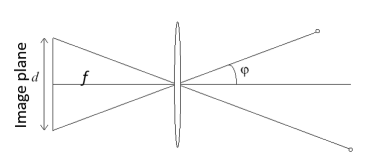

# Image processing

## Image formation

<table style="border-collapse: collapse; border: none;">
<tr>
<td valign="top" width="50%" style="border: none;">

+ pinhole camera: box with a small aperture, image is turned upside down
+ $FOW = 2 \times \varphi$ &rarr; angular measure of space percieved by the camera:
    + $\varphi = \arctan(\frac{d}{2f})$
    + small $f$ &rarr; wide-angle image = large $FOW$
    + large $f$ &rarr; telescopic image = small $FOW$
</td>
<td valign="top" width="50%" style="border: none;">

<!-- Replace `URL_to_Image` with the actual URL of your image -->

</td>
</tr>
</table>

+ effects of **aperture size**:
    + too large &rarr; multiplle directions averaging, blurred image
    + too small &rarr; light starts diffracting, blurred image
    + generally, a small number of rays hit the film, which results in a dark image &rarr; add a lens
+ the **lens** focuses light to film &rarr; the rays that travel through the center do not refract, points at particular distance remain in-focus, others are blurred
    + thin lens &rarr; points at different depths get focused on different depths of image plane
    + depth of field = distance between image planes at which the blutting effect is suffieiently small
    + small aperture increases depth of field
+ **chromatic aberration** = different wave-lengths refract at different angles and focus at different distances
+ **spherical aberration** = spherical lenses do not dlight perfectly - rays closer to lens edge focus closer than those at center
+ vignetting, radial distortion

## Color perception

For digital images, we use a matrix of sensors and quantise light into intensity levels.

In digital cameras, in classical design, we cannot read of R, G, and B channel at a single pixel. Most cameras use **Bayer filer** (CCD based - reads out charge serially and digitizes), which is a color filter array for arranging RGB color filters on a square grid. It has the twice as many G as B and R, because luminance is mostly determined by the green values, and human eye is much more sensitive to changes in intensity than color.
**Foveon X3** is CMOS based sensor (digitization on each cell seperately), and its based on the fact that RGB colors penetrate the silicon at different depths. It gives better image quality.

## Image processing 1

+ RGB to grayscale: $\frac{I(x,y,1) + I(x,y,2) + I(x,y,3)}{3}$
    + at each coordinate $[x,y]$, we have 3 gray-scale values (RGB)
+ binary images - only 1 or 0 (foreground/background), used in machine vision
    + we get binary images from grayscale images using **thresholding**

#### Image thresholding
+ transformation of a grayscale to binary
+ we can apply single or multiple thresholds, or a classifier
+ generally, a difficult problem &rarr; what threshold to pick?
+ threshold $T$ should **minimize** intensity variances within classes seperated by it, and **maximize** the betweeen class variance
 
**Otsu's algorithm:**
For a threshold $T$:
1. seperate the pixels into 2 groups by $T$
2. for each group, get an average intensity, and calculate the between class variance
3. select the $T*$, that maximizes the variance: $T* = \argmax_T  [\sigma^2_{between}(T)]$

**Generalization of Otsu:**
+ formulate the problem as fitting 2 Gaussians to the histogram with priors on mizture weights and variances
+ efficiently computed by a single pass through the histogram
+ outperforms all single-pass and all DL algorithms

**Local binarization:**
+ estimate a local threshold in the neighborhood $W$: $T_W = \mu_W + k \cdot \sigma_W$
+ $k \in [-1,1]$, set by user
+ calculates $T$ seperately for each pixel

#### Cleaning the image

+ thresholded image still includes noise
+ morphological operators: remove isolated points and small structures and fill the holes
+ structural element (SE) can be any size:
    + **fit:** all 1 pixels in SE cover 1 pixels in iamge
    + **hit:** any 1 pizels in SE cover 1 pixels in image

**Erosion:**
+ reduce the size of structures (remove bridges, noise...) &rarr; less white
$$
g(x,y) =
\begin{cases} 
1 \quad \text{if } s \textbf{ \textcolor{blue}{fits} } f \\
0 \quad \text{otherwise}
\end{cases}
$$

**Dilation:**
+ increases the size of structures, fills holes in regions &rarr; more white
$$
g(x,y) =
\begin{cases} 
1 \quad \text{if } s \textbf{ \textcolor{blue}{hits} } f \\
0 \quad \text{otherwise}
\end{cases}
$$

**Opening:**
+ erosion, dilation
+ removes small objects, preserves rough shape
+ can filter out structures by selecting the size of structuring element

**Closing:**
+ dilation, erosion
+ fill holes, perserves original shape
+ size of SE determines the max size of holes that will be filled

#### Labelling regions

Goalis to find seperate connected regions. Connectivity determinsed which pixels are considered neighbors.

**Sequential connected components:**
+ process image from left to right, from top to bottom:
    + if current value is 1:
        + if only one nrighbor is 1, copy its label
        + if both are 1 and have the same label, copy the label
        + if they have different labels: copy left label, update table of equivalent labels
        + else, form a new label
+ relabel with the smallest equivalent labels

#### Region descriptors

We can describe an area by perimeter, compactness, centroid... **Ideal descriptor** maps two images of the same object close-by in feature space, and two images of different objects to points far between each other.

# Edge detection

# Fitting parametric models

# Local features

# Camera geometry

# Multiple-view geometry

# Recognition & Detecion