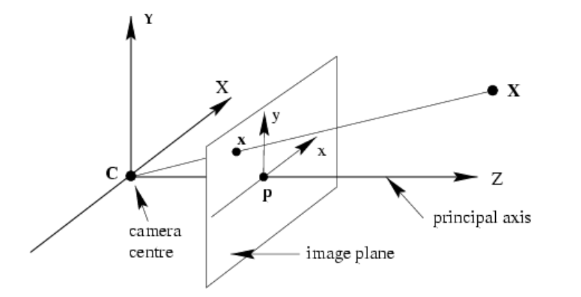

# Image processing

## Image formation

<table style="border-collapse: collapse; border: none;">
<tr>
<td valign="top" width="50%" style="border: none;">

+ pinhole camera: box with a small aperture, image is turned upside down
+ $FOW = 2 \times \varphi$ &rarr; angular measure of space percieved by the camera:
    + $\varphi = \arctan(\frac{d}{2f})$
    + small $f$ &rarr; wide-angle image = large $FOW$
    + large $f$ &rarr; telescopic image = small $FOW$
</td>
<td valign="top" width="50%" style="border: none;">

<!-- Replace `URL_to_Image` with the actual URL of your image -->

</td>
</tr>
</table>

+ effects of **aperture size**:
    + too large &rarr; multiplle directions averaging, blurred image
    + too small &rarr; light starts diffracting, blurred image
    + generally, a small number of rays hit the film, which results in a dark image &rarr; add a lens
+ the **lens** focuses light to film &rarr; the rays that travel through the center do not refract, points at particular distance remain in-focus, others are blurred
    + thin lens &rarr; points at different depths get focused on different depths of image plane
    + depth of field = distance between image planes at which the blutting effect is suffieiently small
    + small aperture increases depth of field
+ **chromatic aberration** = different wave-lengths refract at different angles and focus at different distances
+ **spherical aberration** = spherical lenses do not dlight perfectly - rays closer to lens edge focus closer than those at center
+ vignetting, radial distortion

## Color perception

For digital images, we use a matrix of sensors and quantise light into intensity levels.

In digital cameras, in classical design, we cannot read of R, G, and B channel at a single pixel. Most cameras use **Bayer filer** (CCD based - reads out charge serially and digitizes), which is a color filter array for arranging RGB color filters on a square grid. It has the twice as many G as B and R, because luminance is mostly determined by the green values, and human eye is much more sensitive to changes in intensity than color.
**Foveon X3** is CMOS based sensor (digitization on each cell seperately), and its based on the fact that RGB colors penetrate the silicon at different depths. It gives better image quality.

## Image processing 1

+ RGB to grayscale: $\frac{I(x,y,1) + I(x,y,2) + I(x,y,3)}{3}$
    + at each coordinate $[x,y]$, we have 3 gray-scale values (RGB)
+ binary images - only 1 or 0 (foreground/background), used in machine vision
    + we get binary images from grayscale images using **thresholding**

#### Image thresholding
+ transformation of a grayscale to binary
+ we can apply single or multiple thresholds, or a classifier
+ generally, a difficult problem &rarr; what threshold to pick?
+ threshold $T$ should **minimize** intensity variances within classes seperated by it, and **maximize** the betweeen class variance
 
**Otsu's algorithm:**
For a threshold $T$:
1. seperate the pixels into 2 groups by $T$
2. for each group, get an average intensity, and calculate the between class variance
3. select the $T*$, that maximizes the variance: $T* = \argmax_T  [\sigma^2_{between}(T)]$

**Generalization of Otsu:**
+ formulate the problem as fitting 2 Gaussians to the histogram with priors on mizture weights and variances
+ efficiently computed by a single pass through the histogram
+ outperforms all single-pass and all DL algorithms

**Local binarization:**
+ estimate a local threshold in the neighborhood $W$: $T_W = \mu_W + k \cdot \sigma_W$
+ $k \in [-1,1]$, set by user
+ calculates $T$ seperately for each pixel

#### Cleaning the image

+ thresholded image still includes noise
+ morphological operators: remove isolated points and small structures and fill the holes
+ structural element (SE) can be any size:
    + **fit:** all 1 pixels in SE cover 1 pixels in iamge
    + **hit:** any 1 pizels in SE cover 1 pixels in image

**Erosion:**
+ reduce the size of structures (remove bridges, noise...) &rarr; less white
$$
g(x,y) =
\begin{cases} 
1 \quad \text{if } s \textbf{ \textcolor{blue}{fits} } f \\
0 \quad \text{otherwise}
\end{cases}
$$

**Dilation:**
+ increases the size of structures, fills holes in regions &rarr; more white
$$
g(x,y) =
\begin{cases} 
1 \quad \text{if } s \textbf{ \textcolor{blue}{hits} } f \\
0 \quad \text{otherwise}
\end{cases}
$$

**Opening:**
+ erosion, dilation
+ removes small objects, preserves rough shape
+ can filter out structures by selecting the size of structuring element

**Closing:**
+ dilation, erosion
+ fill holes, perserves original shape
+ size of SE determines the max size of holes that will be filled

#### Labelling regions

Goalis to find seperate connected regions. Connectivity determinsed which pixels are considered neighbors.

**Sequential connected components:**
+ process image from left to right, from top to bottom:
    + if current value is 1:
        + if only one nrighbor is 1, copy its label
        + if both are 1 and have the same label, copy the label
        + if they have different labels: copy left label, update table of equivalent labels
        + else, form a new label
+ relabel with the smallest equivalent labels

#### Region descriptors

We can describe an area by perimeter, compactness, centroid... **Ideal descriptor** maps two images of the same object close-by in feature space, and two images of different objects to points far between each other.

## Image processing 2

#### Filtering

+ noise reduction, image restoration
+ structure extraction/enhancement
+ **Gaussian noise:** the intensity variation sampled from a normal distribution
+ **Salt and pepper noise:** random black and white descriptors
+ **Impulse noise:** random occurrence of white dots

**Gaussian filter:**
+ Gaussian noise = the intensity variation sampled from a normal distribution
+ assumptions: pixels are similar to their neighboring pixels, the noise is independent among pixels
+ remove the noise by computing an averafe of pixel intensities in a pixel's immediate neighborhood

**Correlation filtering:**
+ replace image intensity with a weighted sum of a window centered at that pixel
+ the weights in the linear combination are prescribed by the filter's kernel

**Convolution filtering:** 
+ flip the filter in both dimensions, apply cross-correlation
+ shift invariant
+ linear
+ commutative ($f * g = g * f$), associative ($(f*g)*h = f*(g*h)$) &rarr; applicatiuon of multiple filters is equal to aplication of a single filter, identity (unit impulse), derivative
+ for a symmetric filter, correlation = convolution

**Boundary conditions:**
+ kernel exceeds image boundaries at thye edge
+ crop, bend image, replicate edges, mirror image

**Gaussian kernel:**
+ instead of using uniform weights, pixels closer to the center should have higher weight
+ variance determines the extent of smoothing
+ half size of kernel $= 3\sigma$

**Convolution and spectrum:**
+ convolution of 2 functions in image space is equivalent to the product of their corresponding Fourier transforms &rarr;
 $F(f*g) = F(f) \odot F(g)$
 + convolution manipulates image spectrum (enhances/suppresses frequency bands)
+ Fourier transform = a signal is represented as a sum of sines/cosines of various frequencies

**Removing noise:**
+ noise = adding high frequencies &rarr; to remove them we apply a low-band pass filter (allows low-frequency signals to pass through while reducing the amplitude of frequencies higher than some threshold)
+ a Gaussian manitains compact support in image and frequency space &rarr; appropriate low-band pass filter

**Sharpening filter:**
+ linear filter
+ enhances differences by local averaging

**Filtering as template matching:**
+ apply correlation with template &rarr; dot product = measure of similarity
+ correlation map
+ issue with scaling &rarr; instead of scaling the template, we scale the image

**Reducing an image:**
+ we can't remove every second... pixel &rarr; aliasing (distortion of the signal, because it's not sampled accurately)
+ Nyquist theorem: if we want to reconstruct all frequencies up to $f$, we have to sample the signal by at lease a frequency, equal to $2f$
+ solution: remove the high frequencies that cannot be reconstructed by blurring, then subsample &rarr; Gaussian pyramid
+ reason fo size reduction: Gaussian is a low-band pass filter, so we gerte a redundant representation of the smoothed image &rarr; no need to store it in full resolution

**Median filter:**
+ nonlinear filter
+ replace the pixel intensity by a median of intensities within a small patch
+ doesn't add new gray-levels into the image, removes outliers &rarr; good for impulse and salt&pepper noise removal

#### Color

Light:
+ EM radiaton composed of several frequencies
+ properties described by its spectrum (how much of each frequency is present)

Human color perception:
+ cones &rarr; cells that react differently to different wavelenghts (RGB)
+ rods &rarr; for intensity

**Additive mixture model:** RGB colors added to black (white in the middle), monitors, projectors
**Subtractive model:** cyann, yellow, violet pigment added to white paper (black in the middle) &rarr; pigments remove color, printers, photographic film

Color space is a unique color specification (for reproduction), a new color is a weighted sum of primaries. In uniform color space, the perceptual differences between colors are uniform across the entire space.

#### Color description by using histograms

Image histogram records the frequency of intensity levels. In a color histogram, each pixel is a point in 3D space (RGB), where $H(R,G,B)=$ number of pixels with color $[R,G,B]$. It's a robust representation of images.
Intensity is contained in each color channel. Multiplying a color by a scalar changes the intensity, not the hue. So we can normalize a color by its intensity: $I = R+ G+B$, $r = \frac{R}{I}$, $r+g+b=1$.

If we want to compare images by their descriptors - histograms, we have to measure a distance between histograms. We can do that with: Euclidean distance (differences in histogram cells), pdf similarity (2 probability density functions - Chi-squared, Hellinger...).

# Edge detection

Goal is to map an image from 2D grayscale intensity pixel array into a set of binary curves and lines.

Anything that appears as an edge, constitutes an edge &rarr; local texture, shape changes, discontinuity of depth, shadows... Edge presence is strongly correlated with the local intensity changes &rarr; **derivative** measures a local intensity change.

#### Image derivatives

+ horizontal derivative: $[-1,1]$
+ vertical derivative: $[-1,1]^T$
+ gradient $\Delta f = [\frac{\partial f}{\partial x}, \frac{\partial f}{\partial y}]$ &rarr; points in direction of greatest intensity change
+ smooth the image and then search for edges (remove the noise) &rarr; maxima of $\frac{\partial}{\partial x}(I * G) = I * (\frac{\partial}{\partial x}G)$
+ $\sigma$ is the scale/width of a Gaussian kernel, that determines the extent of smoothing &rarr; which edges will be removed
    + large kernel: detect edges on a larger scale
    + small kernel: detect edges on a smaller scale

#### From derivatives to edge detection

Approach: find strong gradients + post process.

**Optimal edge detector:**
+ good detection: minimizes probability of false positives (edges caused by noise) and false negatives (missing true edges)
+ good localization: detected edges are close to the location of the true edges
+ specificity: returns only a single point per true edge (minimize number of local maxima around true edge)

**Canny edge detector:**
+ most popular
+ a step function + Gaussian noise
+ first derivative of a Gaussian well approximates an operator that optimizes a tradeoff between signal-to-noise ratio and localization on the specified theoretical edge model
+ method:
    + filter (convolve) image by a derivative of Gaussian (smooth and enhance)
    + calculate the gradient magnitude and orientation
    + thin potential edges to a single pixel thickness &rarr; **non-maxima suppression**
        + for each pizel check, if it's a local maximum along its gradient direction
        + only local maxima remain
    + select sequences of connected pixels, that are likely an edge &rarr; **hysteresis thresholding**
        + apply 2 thresholds
        + start tracing a line only at pixels above $k_{high}$ and continue tracing if pixel exceed $k_{low}$

#### Edge detection by parametric models

Line fitting - many scenes are composed of straight lines. Problems with line fitting: nopisy edges (which points correspond to which lines), some parts of lines not detected, noisy orientation... We use line fitting by voting for parameters with Hough transform. For eache dge point, compute parameters of all possible lines passing through it, and for each set of parameters cast a vote. Then select the lines that recieve enough votes.

**Hough space:**
+ a line in image corresponds to a point in Hough space
+ for a point $(x,y)$, find all $(m,b)$ for which holds $y=mx+b$
+ a point in image space corresponds to a line in Hough space &rarr; if 2 lines intersect in Hough space at $(m_{opt}, b_{opt})$, then they lie on the same line $y = m_{opt}x + b_{opt}$ in the image space
+ issue with Cartesian $(m,b)$: we get infinite values for vertical lines &rarr; we use a sinusoid in Hough space to represent a point in the image: $x\cos\theta -y\sin\theta = d$

**Hough transform:**
1. initialize $H[d,\theta]=0$ (*accumulator array*)
2. for each edge point $(x,y)$ in image:
    &nbsp;&nbsp;&nbsp;&nbsp; for  $\theta=0$ to $180$ do:
    &nbsp;&nbsp;&nbsp;&nbsp;&nbsp;&nbsp;&nbsp;&nbsp;&nbsp;&nbsp;$d=x\cos\theta -y\sin\theta$
    &nbsp;&nbsp;&nbsp;&nbsp;&nbsp;&nbsp;&nbsp;&nbsp;&nbsp;&nbsp;$H[d,\theta]+=1$
3. find local maxima $\{ d^{i}_{\text{opt}}, \theta^{i}_{\text{opt}} \}_{i=1}^{N}$ in accumulator array $H$
4. detected line is defined by $d^{i}_{\text{opt}} = x \cos \theta^{i}_{\text{opt}} - \sin \theta^{i}_{\text{opt}}$

Problem with noise in Hough transform: random points still form some local maxima in the accumulator array. The solution is that instead of checking each theta, we use gradient direction at $(x,y)$ as $\theta$. And instead of assigning the same vote for everyone, we use magnitude: $H(d,\theta) += m(x,y)$.

We can also use Hough transform for circles, where we draw a circle with a predifined radius in Hough space for every point in image space. The intersection of the circles in Hough space corresponds to the center of the circle in image space. For an unknown radius, we need a 3D Hough space, where we map cones.

**Generalized Hough transform (GHT) for shape-based models:**
+ define the shape model by edge points and a reference point
+ model learning: for each edge point use its gradient orientation $\theta$ to index into the table and use the displacement vectors $\vec{r}$ to cast a vote for the center

Advices for Hough transform: minimize irrelevant responses, appropriately discretize the parametric space, vote for neighboring cells as well (cast a vote with a Gaussian), use gradient direction

**Pros:** each point processed independently (robustness, parallelizable), robustness to noise, can detect multiple instances of a single model in one pass.
**Cons:** time complexity increases exponentially with number of free parameters, some shapes may generate false local maxima, choosing the accumulator cell size is application dependent.

# Fitting parametric models

+ transformation: $X'_i = f(X_i;\vec{p})$
+ $X_i = [x_i, y_i]^T$
+ $\vec{p}=[p_1,...,p_m]$

Use cases:
+ given a set of correspondences, what are the parameters of the transformation?
+ assuming the transformation can be well approximated by $f(x;p)$, what are the best parameter values for $p$? &rarr; those that minimize the projection error
+ used for mapping 2D into 3D

### Least squares: Line fitting

**Least squares:**
+ data: $\{(x_1,y_1),...,(x_N,y_N)\}$
+ line equation: $y=f(x;p)=xp_1+p_2$
+ projection error at i-th correspondence: $\varepsilon_i=f(x_i;p)-y_i$
+ cost function: $E(p)=\sum_{i=1}^N\varepsilon_i^2$
+ best parameters: $\hat{p} = \argmin_p E(p)$

**Minimizing least squares:** $p=A^\dagger b$

**Weighted least squares:**
+ weighted cost function: $E(p)=\sum_{i=1}^N w_i \varepsilon_i^2$
+ can be used for nonlinear/robust least squares

**Minimizing weighted least squares:** $p=(A^TWA)^{-1}A^TWb$

**Constrained least squares:**
+ cost function: $E(p)=\sum_{i=1}^N  ||\varepsilon_i||^2$
+ trivial solution is $p=0$, nontrivial solution is obtained by constraint $||p||^2=1$

**Minimizing constrained least squares:**
+ $A^TAp=\lambda p$
+ the solution is the eigenvector of $(A^TA)$, corresponding to the smallest eigenvalue, which is the eigenvector, corresponding to the smallest eigenvalue of $A$
+ SVD decomposition

We often use **nonlinear error/cost functions**, which cannot be minimized analytically in a closed form. Then we use gradient descend, Newton method, Gauss-Newton method...

### Outliers, RANSAC

Large disagreements in only a few points - outliers, cause falioure of the least squares based methods. The direction, localization and recognition have to operate in significantly noisy data. In some cases, more than a half of data is expected to be outliers. Standard models for robust estimation can rarely deal with such large proportion of outliers.

RANSAC - random sample consensus algorithm is very popular due to its generality and simplicity. It can deal with large portions of outliers. We find a model with strong support by randomly sampling potential models.

If we want to fit a line to points, we randomly sample 2 points and connect a line through them. Then we count the number of inliers - all points whose $\varepsilon_i$ is lower than some threshold. We repeat that over $N$ iterations, or until the number of inliers becomes big enough.

**RANSAC algorithm:**
1. randomly select the smallest group of correspondences, from which we can estimate the parameters of our model
2. fit a parametric model $\hat{p}$ to the selected correspondences
3. project all other points and count the number of inliers

The model parameters $\hat{p}_{opt}$ maximize the number of inliers.

**The choice of parameters:**
+ how many correspondences? as many as the model parameters
+ threshold? choose $t$ such that the probability that an inlier falls below $t$ is $p_w$, usually $p_w=0.95$, if we have a Gaussian: $t=2\sigma$
+ number of iterations? choose $N$ such that the probability $p$ of drawing a sample with all inliers at least once is high enough
    + $e$ = proportion of outliers (probability of selecting an outlier at random)
    + probability of choosing a single inlier = $1-e$
    + we have $s$ correspondences so probability of all-inlier sample = $(1-e)^s$
    + probability that at least one in $s$ is not an inlier = $[1-(1-e)^s]$
    + $1-p = [1-(1-e)^s]^N \rightarrow N = \frac{\log(1-p)}{\log(1-(1-e)^s)}$

We can **improve RANSAC** by applying least squares to the inliers. After computing the best inliers, we use least squares to fit a new model to all the inliers. This makes the final model more accurate.

If we have multiple instances of our model (multiple lines for example), we apply voting to RANSAC. If we have multiple models, we apply model selection.

**Pros:** simple, applicable, often used in practice
**Cons:** requires setting some parameters, potentially a lot of iterations, fails at small number of inliers

# Local features

In panoramic photos, we: detect ket-points in both images, find pairs of corresponding points and use the pairs for image registration.

Efficient keypoint detector requirements:
+ detect the same structure independently in each image (high detection stability)
+ for each point find a corresponding point in the other image

### Keypoint detection

We use corners as keypoints, because they are distinctive and repeatedly occur on the same structure, even if it changes pose in 3D. For that, we need a corner response function (CRF), which would have high value when it detects a corner. A good criteria for CRF is **self similarity**: we observe a small window around a potential corner and a small shift in window in any direction results in large intensity change -
+ flat region: small shift doesn't change intensity
+ edge: no change when shifting along the edge, otherwise there is change
+ corner: shift in any direction significantly changes local intensity

**Harris corner detector:**
+ intensity change for a shift $[u,v]$: $E_R(u, v) = \sum_{x,y \in R} w(x, y) \left( I(x, y) - I(x + u, y + v) \right)^2$
+ the weight function is a Gaussian kernel
+ for small shifts we have to linearize it &rarr; derivatives of the image
+ for small shifts we can approximate it with: $[u,v]M[u,v]^T$m where $M$ is a $2\times 2$ matrix of image derivatives, or more efficiently, $M$ is the covariance matrix of region gradients:
$$M = \begin{bmatrix}
G(\sigma) * I_x^2 & G(\sigma) * I_x I_y \\
G(\sigma) * I_x I_y & G(\sigma) * I_y^2
\end{bmatrix}$$
+ we detect a corner by analyzing the gradient covariance matrix
+ decompose $M$ (*visualize $M$ as an ellipse*):
$$M = R \begin{bmatrix}
\lambda_{\text{max}} & 0 \\
0 & \lambda_{\text{min}}
\end{bmatrix} R^T$$
where eigen values mean ellipse scaling and eigen vectors the ellipse rotation
+ a corner has a strong gradient in both major directions &rarr; corner is present when both eigenvalues are large
+ in practice, we don't calculate eigenvalues, because that's computationally expensive, we just look at their ratio: $\text{det}(M) - \alpha \text{trace}^2(M) > t$

**Harris corner detector algorithm:**
1. calculate the image derivatives
2. filter them with the Gaussian
3. check for corner presence (2 strong eigenvalues)
4. apply non-maxima suppression

**Hessian corner detector:**
+ determinant of Hessian (Hessian = measure of local curvature)
$$H(I) = \begin{bmatrix}
I_{xx} & I_{xy} \\
I_{xy} & I_{yy}
\end{bmatrix}$$

CRF is rotation invariant, however it is not invariant to scale change.

### Scale selection

Scale selection is important, because it ensures that keypoints are detected in a way, that is invariant to changes in image scale. A keypoint might look like a corner at one scale, but not at another, which is why scale selection is important.

For each keypoint, we must select the characteristic scale independently. We define a signature function $f(\sigma)$ that reaches maximum at the optimal scale. We then evaluate the function for different scales.

Natural images abundantly containt blob-like features, We want to detect them, because blobs differ in properties compared to its surroundings. We can then use blobs to represent object/features in an image. For that we use **LoG - Laplacian of Gaussian**, which is a circular-symmetric operator for blob detection. The characteristic scale is the scale at which LoG filter yields a maximum response. So we then use the local maxima in scale space of LoG filter as keypoints.

LoG can be well approximated with a difference of Gaussians at different values of $\sigma$: $DoG=G(x,y,k\sigma) - G(x,y,\sigma)$. This is good, because the results of Gaussian filtering are already calculated during calculation of image resizing (Gaussian pyramid): $\sigma_{next} = 2\sigma_{prev}$.

**Lowe's DoG based detector:**
+ find local maxima of DoG in scale space (check 26 neighbors - $8+2*9$)
+ remove low contrast points if local change in response in small compared to neighbors
+ remove points detected at edges (Hessian)

### Local descriptors

Keypoint descriptors must be:
+ distinctive: different for keypoints on different structures
+ invariant to ambiental changes (geometric and photometric transformations)

For comparing regions &rarr; **normalize** - rescale to a predefined size.

**Normalizing rotation:** 
+ need to automatically determine the inherent orientation of every patch, independently of all others
+ algorithm:
    + calculate the histogram of orientations 
    + rotate gradients to adjust them to align with a standardized direction
    + find all orientations whose amplitude is $>80%$ of the strongest bin
    + output each detected oriented region as seperate keypoint

**Normalizing affine transformation - Affine adaptation:**
+ for very large changes in viewpoint, we require an affine adaptation (invariance to translation, scale and rotation is not enough)
+ iterative algorithm:
    + in circulat window, calculate gradient covariance matrix
    + estimate an ellipse from $M$
    + using new window, calculate the new covariance matrix and iterate
+ basically, we want to transform initial circular regions (detected keypoints) into ellipses, that better align with geometrix distortions present in the image
+ $\Epsilon = USU^T$, where rotation is $U^{-1}$ and scale is $S^{-1/2}$

**SIFT - Scale Invariant Feature Transform:**
1. split a region around a keypoint into $4\times 4$ sub-regions
2. calculate gradients on each pizel and smooth over a few neighbors
3. in each cell, calculate a histogram of gradient orientations (8 directions)
    + each point contributes with a weight proportional to its gradient magnitude
    + contributon weighted by a Gaussian centered at region center
4. stack histograms and normalize &rarr; descriptor with ($4*4*8=$) 128 dimensions
+ robust - 60 degrees out-of.plane rotation, robust to significant intensity changes, fast

**correspondences using keypoints:**
+ compare keypoints by using Euclidean distance
+ keep only symmetric matches (A is a point from left image, B is its match in the right image - if B is most similar to A among all points in the right image and vice-versa, they are a symmetric match)
+ calculate the distance between A and the first and second most similar keypoints in the right image, the ratio will be low for distinctive keypoints and high for non-distinctive ones

**MaSt3r:**
+ image matching in 3D
+ considers keypoints + descriptors + 3D jointly
+ recent

# Camera geometry

We require a model of 3D-to-2D transform to measure the 3D content.

Single-view geometry:
+ points in a 3D coordinate system project to image plane into 2D pixels
+ project decomposed into 2 kinds:
    + **extrisic projection** = 3D world &rarr; 3D camera
    + **intrinsic projection** = 3D camera &rarr; 2D image

### Intrinsic projection

Image formation process:
+ poiny written in camera 3D coordinate system (meters)
+ projected to camera image plane (meters)
+ projected to discretized image (pixels)

We use **homogeneous coordinates** - where we change Cartesian form $[x,y]^T$ and turn it into $[x,y,1]^T$. We do that, because multiplying by a scalar no longer changes the point. If we want to turn it back to Euclidean, we simply divide by last coordinate.

**Camera coordinate system (meters):**
<table style="border-collapse: collapse; border: none;">
<tr>
<td valign="top" width="50%" style="border: none;">

+ principal axis $Z$: a line from camera center, perpendicular to image plane
+ principal point $p$: a point where the principal axis punctures the image plane
+ normalized coordinate system: 2D system with origin at $p$
+ projection as vector-matrix multiplication, qhwew $\vec{x}$ is in 2D image space and $X$ is in 3D camera:
$$\vec{x} = P_0X$$
$$\left[ \begin{array}{c}
fX \\
fY \\
Z \\
\end{array} \right]
=
\left[ \begin{array}{ccc}
f &   &   & 0 \\
 & f & & 0 \\
 &  & 1 & 0\\
\end{array} \right]
\left[ \begin{array}{c}
X \\
Y \\
Z \\
1 \\
\end{array} \right]
$$

</td>
<td valign="top" width="50%" style="border: none;">

<!-- Replace `URL_to_Image` with the actual URL of your image -->

</td>
</tr>
</table>

**From image plane to image pixels:**
<table style="border-collapse: collapse; border: none;">
<tr>
<td valign="top" width="50%" style="border: none;">

+ normalized camera coordinate system: origin in principal point $p = [p_x,p_y]^T$
+ image coordinate system: origin in th corner of the image sensor
+ we need to change the coordinate system origin by the principal point $p$:
$$\left[ \begin{array}{c}
fX + Zp_x \\
fY + Zp_y \\
Z \\
\end{array} \right]
=
\left[ \begin{array}{ccc}
f &   &  p_x & 0 \\
 & f & p_y & 0 \\
 &  & 1 & 0\\
\end{array} \right]
\left[ \begin{array}{c}
X \\
Y \\
Z \\
1 \\
\end{array} \right]
$$

</td>
<td valign="top" width="50%" style="border: none;">

</td>
</tr>
</table>

+ we project onto a sensor of size $W_S \times H_S$ (in meters)
+ pixels a rearranged into a rectangular $M_x \times M_y$ pixel matrix, where $m_x = \frac{M_x}{W_S}$
+ we then project it with matrix multiplication:
$$
\left[ \begin{array}{c}
x \\
y \\
z \\
\end{array} \right]
=
\left[ \begin{array}{ccc}
m_x & 0 & 0 \\
0 & m_y & 0 \\
0 & 0 & 1 \\
\end{array} \right]
\left[ \begin{array}{ccc}
f & 0 & p_x & 0 \\
0 & f & p_y & 0\\
0 & 0 & 1 & 0\\
\end{array} \right]
\left[ \begin{array}{c}
X \\
Y \\
Z \\
1 \\
\end{array} \right]
$$
+ generally, it's hard to guarantee a rectangular sensor &rarr; $s$ is for skewed:
$$
\left[ \begin{array}{c}
x \\
y \\
z \\
\end{array} \right]
=
\left[ \begin{array}{cccc}
\alpha_x & s & x_0 & 0 \\
0 & \alpha_y & y_0 & 0 \\
0 & 0 & 1 & 0 \\
\end{array} \right]
\left[ \begin{array}{c}
X \\
Y \\
Z \\
1 \\
\end{array} \right]
$$

**Calibration matrix** $K$ prescribes projection of 3D point in camera coordinate system into pixels:
$$
K = \left[ \begin{array}{ccc}
\alpha_x & s & x_0 \\
0 & \alpha_y & y_0 \\
0 & 0 & 1 \\
\end{array} \right]
$$
+ $\alpha_x, \alpha_y =$ focal length of camera in terms of pixels along x and y-axis
+ $s = $ skew coefficient between the x and y axes (ideally 0)
+ $x_0,y_0 =$ coordinates of the principal point $p$ (ideally the intersection point of the optical axis of the lens with the image plane) - they represent the offset from the top-left corner of the image sensor (in pixels)

### Extrinstic projection

The 3D camera coordinate system is related to 3D world by a rotation matrix $R$ and translation $\tilde{C}$:
<table style="border-collapse: collapse; border: none;">
<tr>
<td valign="top" width="50%" style="border: none;">

+ $R = $ how to rotate the world CS around its own origin to align it with camera CS
+ $\tilde{C}=$ camera origin in world CS
+ $\tilde{X}=$ point in 3D world CS
+ $\tilde{X}_{cam}=$ some point $\tilde{X}$ written in 3D camera CS

**World to camers CS transformation:**
$$\tilde{X}_{cam} = R(\tilde{X} - \tilde{C})$$
$$\mathbf{X}_{\text{cam}} = \left[ \begin{array}{cc} R & -R \tilde{C} \\ 0 & 1 \end{array} \right] X$$

&nbsp;

We have camera parameters specified by a calibration matrix $K$, the projection center in world CS $\tilde{C}$ and the rotation matrix $R$. A 3D point in the homogeneous world coordinates $X$ is projected into pixels $x$ by:
$$x = PX$$
where the projection matrix $P = K \left[ R | -R\tilde{C} \right]$

</td>
<td valign="top" width="50%" style="border: none;">

</td>
</tr>
</table>

### Lenses and nonlinearity

Lens adds a nasty nonlinearity. Straight lines are no longer straight, which is why we must remove nonlinearity to apply a pinhole model.

We assume that lens distortion is radially symmrytic and so we radially expand an image to un-distort it. Int his transformation, we only change the radius of the transformed point, whereas the angle stays the same.

For transformation, we typically use a low degree polynomial and we estimate the parameters by adjusting them until straight lines become straight.

### Degrees of Freedom (DoF)

Degrees of freedom refer to the number of independent parameters, required to fully drescribe the camera's configuration and behaviour. Each DoF corresponds to an independent variable.

**Intrinsic parameters &rarr; 5 DoF:**
+ principal point coordinates (2)
+ focal length (1)
+ pixel scaling factor (1)
+ shear - nonrectangular sensor array (1)
+ radial distortion

**Extrinsic parameters &rarr; 6 DoF:**
+ rotation (3)
+ translation (3)

**Camera projection matrix:**
+ pinhole camera: 9 DoF (*principal point coordinates, focal length, rotation, translation*)
+ camera with rectangular pixels: 10 DoF (*we get 2 seperate focal lengths*)
+ general camera (skewed sensor): 11 DoF (*+ shear*)

### Homography

Homography is a plane-to-plane projection. The elements of a homography matrix $H$ can be estimated by applying a direct linear transform.

**Homography estimation** is a process of computing a homography matrix $H$, that maps points from one plane to another. 
**Homography matrix** is a $3\times 3$ matrix that relates 2 planar projections of the same scene. 
\[
H =
\begin{bmatrix}
h_{11} & h_{12} & h_{13} \\
h_{21} & h_{22} & h_{23} \\
h_{31} & h_{32} & h_{33}
\end{bmatrix}
\]

We can assume:
\[
\begin{bmatrix}
x' \\
y' \\
1
\end{bmatrix}
\simeq
H
\begin{bmatrix}
x \\
y \\
1
\end{bmatrix}
\]

By setting \( h_{33} = 1 \), the equations simplify to:

\[
x' = \frac{h_{11} x + h_{12} y + h_{13}}{h_{31} x + h_{32} y + 1}
\]
\[
y' = \frac{h_{21} x + h_{22} y + h_{23}}{h_{31} x + h_{32} y + 1}
\]

We can also use **preconditioning**. DLT works well, if the corresponding points are normalized seperately in each view: $\tilde{x} = T_{pre}x$, where we choose $T_{pre}$ such that the mean of points $\tilde{x}_i$ is 0 and their variance 1.

**Homography estimation algorithm:**
1. apply preconditioning to points in each image seperately:&nbsp; $\tilde{x}' = T_{\text{pre}}' x'$, &nbsp; $\tilde{x} = T_{\text{pre}} x$
2. apply DLT to estimate homography: &nbsp; $\tilde{x}'=\tilde{H}\tilde{x}$
3. transform back the solution to remove preconditioning:&nbsp; $H = T_{\text{pre}}'^{-1} \tilde{H} T_{\text{pre}}$

### Vanishing points

Sets of 3d parallel lines intersect at a vanishing point. Where in image do sets of 3D parallel lines projections intersect? As we push a point towards infinity away from the camera, the projection approaches the vanishing point $v$.

Vanishing point depends on direction, not on point. A different set of parallel lines correspond to a different VP. **Horizon** is formed by connecting the vanishing points of a plane. Therefore horizon is a collection of all the vanishing points.

### Camera calibration

Assume a fixed camera in 3D that we want to use for measuring: $\lambda x = PX$.

Camera calibration is the process of determining the intrinsic and extrinsic parameters of a camera. These parameters describe how the camera projects 3D points in the real world onto a 2D image plane. The goal is to estimate the camera projection matrix $P$, which encapsulates both the intrinsic and extrinsic properties of the camera. We have a known calibration object (grid) and we use it to estimate $P$.

Proper calibration requires measuring points at sub-pixel accuracy and highly depends on the calibration pattern. For 11 parameters in $P$, we need to use at least 28 points.
Each 2D &rarr; 3D correpsondence provides 2 linearly independent equations. Since $P$ has 11 DoF and each correspondence provides 2 equations, we need at least 6 correspondences to solve the system. If all the 3D points used for calibration lie on a single plane, the system becomes degenerate &rarr; the object should have non-coplanar points.

# Multiple-view geometry

The depth of a point cannot be calculated from a single 2D image without a scene model/prior information. That happens, because all points along a ray that passes through a camera center are projected into the same point in the image plane. Therefore it's impossible to calculate a 3D point from a single 2D point.

### Stereo geometry and scene reconstruction

<table style="border-collapse: collapse; border: none;">
<tr>
<td valign="top" width="50%" style="border: none;">

We estimate depth by **triangulation**. Reconstruction is calculated by intersection of 2 rays. We assume that we have a known camera position in 3D (calibration) and we have a known correspondence between points.

With a linear approach, we can just write a homogeneous system and solve it. If we want to refine it for nonlinear, we need to find $X$ that minimizes a sum of reprojection errors. This requires an iterative algorithm and gives the most accurate solution.

&nbsp;

Generally, correspondences are unknown in advance. We do know the location of the right camera with respect to the left one. So given a point $p$ in the left image, we have to constrain the search region of the corresponding point in the right image. Potential matches for $p$ lie on the corresponding epipolar line $l'$.

</td>
<td valign="top" width="50%" style="border: none;">

</td>
</tr>
</table>

<table style="border-collapse: collapse; border: none;">
<tr>
<td valign="top" width="50%" style="border: none;">

**Epipolar constraint:**
+ given a point $x$ in the left image, what is the equation of the epipolar pine in the right image?
    &nbsp;

In a **calibrated system**, points are defined as $p = \lambda_i X$, where $\lambda_i$ is a scalar. We have the equation $p^TEp'=0$, where $E$ is an essential matrix $E = \left[ T_{\times} \right]R$ that relates corresponding image points.

A 3D point is mapped to points $p$ and $p'$. The epipolar line for the left camera is $l = Ep'$, and for the right camera $l' = (p^TE)^T$.

</td>
<td valign="top" width="50%" style="border: none;">

</td>
</tr>
</table>

In a **noncalibrated system**, we must convert the points from meters to pixels. We get a system $\hat{x}^T F \hat{x}' = 0$, where $\hat{x}$ is in image pixels, and it holds $\hat{x} = Kx$. $F$ is fundamental matrix $F=K^{-1}EK'^{-1}$. 
So the epipolar line $l = F'x'$ corresponds to $x'$.

**Epipolar geometry - definitions:**
+ baseline = a line connecting camera centers
+ epipole = point where the baseline punctures the image plane
+ epipolar plane = plane connecting 2 epipoles at a 3D point
+ epipolar line = intersection of epipolar plane and image plane (*all epipolar lines of a single image intersect at the camera epipole*)

### Geometry of a simple stereo

<table style="border-collapse: collapse; border: none;">
<tr>
<td valign="top" width="50%" style="border: none;">

We have a calibrated stereo system with parallel optical axes. This simplifies a problem. So given $[x,y]$ in the left image, where will the corresponding $[x',y']$ be in the right image.

System:
+ parallel optical axes with aligned image lines
+ a 3D point written in coordinate system of the left camera $^LP$
+ baseline $b_x$ = displacement of the right camera along $x_L$
+ focal length $f$ = distance of image planes in both cameras from their projection centers

The corresponding points lie on the same line of pixels - epipolar line. We then align the right projection onto the left image - displacement by $-b_x$.

3D coordinates from disparity: 
+ depth: $Z = f\frac{b_x}{d}$
+ $X = x_L\frac{b_x}{d}$
+ $Y = y_L\frac{b_x}{d}$

</td>
<td valign="top" width="50%" style="border: none;">

</td>
</tr>
</table>

**Stereo image rectification:**
+ simplifies the matching of corresponding points between 2 images from different viewpoints
+ convenient if the lines for searching the matches correspond to the epipolar lines
+ reproject image planes into a common planem parallel to baseline
+ 2 homography matrices for reprojection of left and right image planes

**Disparity:**
+ difference in the positions of corresponding points in 2 stereo images
+ relates the right image to the left
+ coordinate of the corresponding point in the right image $= x$ coorinate of the point in the left camera $+$ disparity value at that point
+ estimation problem: for each pixel in the left image, we need to find the corresponding pixel in the right image (disparity = difference in $x$)

**Disparity estimation:**
+ for a patch centered at a pixel in the left image, compare to all patches in the right image along the same epipolar line
+ select the patch with the greatest similarity
+ difference in position of left patch and right patch is the disparity
+ the influence of window size $W$:
    + small $W$: details better estimated, noise disparity, faster
    + large $W$: details lost, (over)smoothnes, slower
+ optimize by using global disparity (independently at each pixel)
+ constraints: points on single surface appear in same order, slow local depth change
+ semi global block matching (?)

**Application:** filling-in the previously occluded scene regions for better realism...

### Reconstruction from multiple images

Given several images of the same scene, we need to reconstruct all camera positions and the 3D scene. We assume a partially calibrated case, in which $K$ is known.

**Steps:**
1. find keypoints
2. find good matches
3. calculate $F$
4. calculate $E$
5. $\left[R|t\right]$
6. triangulation

**3D reconstruction pipeline:**
+ trangulation requires: knowing correspondences and the projection matrices $P_j$ for all $M$ cameras
+ compute $P_j$ from $K_j, R_j, t_j$
+ compute $R_j, t_j$ from $E_j$
+ compute $E_j$ from $F_j, K_1, K_j$

**Fundamental matrix estimation:**
+ we estimate $F$ that minimizes reprojection errors
+ 8 point algoritm - we get one equation per correspondence, so we need 8 correspondence
+ normalized 8 point algorithm:
1. center image points and scale
2. calculate $F$ with 8 point algorithm
3. enforce rank$=2$
4. transform $F$ back to its original units

Generally, correspondances are unknown. So we have to find keypoints in each image, calculate possible matches and estimate the epipolar geometry with RANSAC.

**RANSAC to robustly estimate $F$:**
1. randomly select a set of 8 correspondences
2. calculate $F$ using them
3. estimate how many of them support $F$
4. choose $F$ with maximal number of inliers

### Active stereo

The idea is to project structured light patterns over the object, This simplifies the correspondence problem and we can only use a single camera.
An example is laser scanning. Here we do an optical triangulation: project a laser light plane, move over an object and precicely scan it.

Multi-band triangulation is when we project multiple bands to speed-up the scanning. Which pixels belong to which band? We assume smooth surface, project color bands...

# Recognition & Detecion

## Classical approaches

We have tagged an object with a bounding box.

#### Recognition by classification

We select the one with minimal distance or the one with sufficiently small distance. The quality of recognition depends on the quality of image representation - features.

How do we determine the features?
1. linear coordinate systems (linearly transform the data)
2. feature selection (ML to select optimal features from a pool of transforms)
3. handcrafted nonlinear transforms (improve feature robustness)
4. end-to-end learning of feature transform (ML of the entire feature extraction and selection pipeline)

#### Learning natural coordinate systems by subspace methods

**Subspace estimation:**
+ find a low-dimensional linear subspace, such that projection of the data onto the subspace does not result in information loss
+ we are given $N$ $M$-dimensional points (images), we need to find a unit vector $u \in R^M$ such that projection to this vector will minimize the reconstruction error
+ formally: minimize the sub of reconstuction errors = maximize the variance of projected points

**PCA:**
+ want to maximize $var(a) = u^T \Sigma u$
+ variance maximized by $u$ that satisfies $\Sigma u = \lambda u$
+ the maximum of $var(a) = \lambda$ is reached at the largest eigenvalue
+ variance maximized by the eigenvector that corresponds to the largest eigenvalue
+ PCA is essentially a change of CS that captures major directions of variance in the data

**Projection and reconstruction:**
+ projection of data $x_i$ into the new CS: $y_i = U^T(x_i - \mu)$
+ reconstruction back into original CS: $x_i = Uy_i + \mu$

<table style="border-collapse: collapse; border: none;">
<tr>
<td valign="top" width="50%" style="border: none;">

**How many eigenvectors for reconstruction?**
+ sum of squared differences $\epsilon (m)$ between training images and their reconstruction is given by:
$$\epsilon(m) = \sum^N_{j=m+1} \lambda_j$$

</td>
<td valign="top" width="50%" style="border: none;">

</td>
</tr>
</table>

**Algorithm for building a subspace:**
1. reshape training images into column vectors
2. calculate the average image
3. center data (substract average image)
4. calculate covariance matrix
5. calculate eigenvector and eigenvalue matrix (SVD)
6. construct a matric using only first $K$ eigenvectors
7. now we can project and reconstruct each test image

We can use dual PCA, when the number of features is much larger than the number of samples. Instead of decomposing the covariance matrix, it works on the Gram matrix, which is the inner product matrix of the data.

**Classification by subspace reconstruction:**
+ if the window contains a category for which the subspace was constructed, the reconstruction will work well, otherwise not
+ if we use a large collection of faces to construct the subspace, only faces will be reconstructed by the subspace &rarr; we can exploit this property for detection/recognition

**Detection by distance from subspace:**
+ use a subspace learned on faces to detect a face
+ slide a window over each image position and calculate the reconstruction error
+ repeat for all scales (normalize)
+ low reconstruction error indicates a face (apply a threshold)

**PCA is a linear autoencoder.**

Even in PCA, the same object viewed under different conditions (light, orientation) projects into different parts of the subspace. We could **generate different appearances** by accessing a specific part of the subspace: $x = Uy + \mu$, where $y$ is a subspace point (vector). For this linear encoders are weak, but neural network encoders are more powerful.

Reconstruction subspace is not optimal for discrimination - if we wanted to figure out whether the person is wearing glasses... How do we come up with featues?

#### Learning features by feature extraction

To achieve real-time processing, feature extraction and classifier application should be fast. To choose the appropriate classifier we can use: nearest neighbors, NNs, SVMs, boosting, conditional random fields...

Classifiers are algorithms, that assign a label to a given input.

**AdaBoost:**
+ task: build a classifier which is a weighted sum of many weak classifiers
+ weak classifiers are fast to compute
+ algorithm:
    + train a sequence of weak classifiers
    + each weak classifier splits training examples with at least 50% accuracy
    + those examples that are incorrectly classified get more weight in the next weak classifier
    + the final classifier is a combination of the weak ones
+ we get fast classifier application

**Efficient computation - integral images:**
+ filters based on sums of intensities within rectangular regions
+ can be done in constant time for arbitrary large region
+ require precomputing the integral image
+ large collection of filters - account for all possible paaameters (position, scale...)
+ we extract feaures at each bounding box and apply AdaBoost classifier &rarr; computationally expensive
+ efficiently &rarr; **cascade of classifiers**:
    + apply first few classifiers (fast) to reject the windows that don't contain the category
    + reclassify the surviving regions
    + chain classifiers from least complex to the most complex

**Viola-Jones face detector:** training using positives and a lot of negatives, real-time detectors.

In general, we need much stronger features. We need to account for intra-class vaariation (contrast, illumination) and destinguish between different classes.

How to come up with features? Handcraftet nonlinear transforms

#### Handcrafted nonlinear transforms

Problem: color/gray-level representation is sensitive to illumination changes or whitin-class color variations.

We use **HOG**: histogram od gradient orientations. Orientations are weighted by magnitude. We extract HOGs from perosn/background and train a person/nonperson classifier in a linear SVM. We can use that in pedestrian detection: use a sliding window, extract HOG and classify by linear SVM.

Issues with sliding window object detection:
+ strengths: simple implementation, can deal with scale changes
+ weaknesses: adding aspect change (different W-H ratio) increases the number of bounding boxes to test, feature construction for eaach box increases computational complexity

To fix that, we can generate a small number of hypothesized object bounding boxes and apply a slowe classifier to verify them.

**Selective search:**
+ images are intrinsically hierarchical &rarr; start by over-segmentation into small regions
+ merge 2 most similar regions based on teexture similarity and region size
+ continue until a single region remains
+ from each merged region generate a bounding box
+ high recall, object-category sgnostic, basis for newer computationallty-heavy detectors

## A modern approach

#### End-to-end feature (and classifier) learning

We train a neural network - for an input image we predict the probability of some output. We use gradient descent for adjusting the weights.

**Convolutional NNS** &rarr; goal is to gradually decrease spatial size ($W \times H$) and increase the depth. The basic building blocks:
+ convolutional layer (convolute)
+ nonlinear layer - RELU: implement nonlinear feature transformations, we need specific form for backpropagation to work
+ pooling layer: implements downsamppling (reduce spatial resolution, increase receptive field - pixels that influence the neuron)
+ fully connected layer: maps the feature vector into the final prediction - a vector of probabilities

CNN architecture contains feature extraction and a classifier. Learning means that we learn feature extraction and a classifier. CNNs became popular due to huge labelled datasets. Their speed is inversely proportional with the number of parameters and their accuracy is related to the network complexity.

So far, we considered classifying the entire image, but many applications require more fine-grained classification - assigning a class label to each pixel. For that we use **semantic segmentation**. We apply CNNs to encode each pixel.

**Box regression** is where region proposal generates approximate bounding box and the box regressor defines it. 

#### RCNN

**RCNN** is a region based CNN. The slow version is consisted of region proposal, feature extraction, classification and bounding box regression. It is slow because each of the region proposals is processed independently by the CNN. We can improve it by sharing computations. **Fast RCNN** is consisted of feature extraction, region proposal which generates candidate regions ROIs, ROI pooling, classification and boundin box regression. The problem with fast RCNN is that region proposals have very poor recall and can be slow. We fix this with **faster RCNN**, which consists of feature extraction, region proposal network RPN, ROI pooling, classification and bounding box regression. RPN is a small neural network that slides over the feature map and predicts region proposals and objectness scores. It uses anchor boxes to generate proposals. We can extend faster RCNN with **mask RCNN**, which adds a brach for predicting segmentation masks on each ROI, which allows the network to perform both object detection and instance segmentation at the same time.

## Recognition using local features: Bag of words model

We want texture recognition. Texture is spatially organized repeatable images and can be characterized in terms of textons (small images).

The Bag of Words model represents an image as an unordered collection of visual features, ignoring spatial relationships and structure. It focuses on the frequency of these visual features, treating each image as a "bag" of its constituent visual elements.

It summarizes an image by a distributon (histogram) over visual words. But how do we identify the words?

**1. Feature detection and representation:**
+ use feature point detectors (SIFT)
+ normalize each region to remove local geometric deformation
+ collect descriptors from all key-points from all training images

**2. Clustering by vector quantization:**
+ SIFTs correcponding to the same visual word should be similar &rarr; similar SIFTs form clusters
+ apply K-means clustering to the detected SIFT descriptors
+ each cluster center is a visual word &rarr; keep only cluster centers
+ learn on seperate training data
+ for each detected keypoint, assign the word ID closest to the extracted SIFT

**3. Image representation:**
+ each image represented by a histogram, which is then normalized

**4. Build a classifier:**
+ use the training set
+ classifier needs to classify images based on the extracted bag of word histogram
+ SVM (extract BOWs and train a classifier)

**5. Reconition:**
+ how to classify a new image?
+ encode the image with the dictionary learned in the training stage
+ feed to a classifier trained at training stage

BOW performs very well in image classification despite the background clutter. Strengths are that it has a fixed descriptor length and is robust to object position and orientation. Weaknesses are that it doesn't account for spatial relations among visual words and it doesn't localize objects in the image.

## Object detection by feature constellations

How to detect an object in arbitrary pose and estimate that pose?

We represent the target model in terms of small parts that can be detected even after an affine deformation - keypoints. Then we verify the consistency of geometric configurations.

We could detect by **fitting an affine deformation**. We use an affine model to approximate perspective transform of planar objects and apply RANSAC to get a globally valid correspondence.

We can use **Generalized Hough Transform**:
+ assume features are invariant to scale and rotation
+ each feature casts a vote into the Hough space
1. Index descriptors (we need distinctive descriptors to reduce the search space
2. Apply GHT to obtain approximate detection
3. Refine each detection by fitting affine transform between the points on the object and the detected points from GHT

We can apply this to retrieval systems, specific object recognition (highway vignette verification), augmented reality...